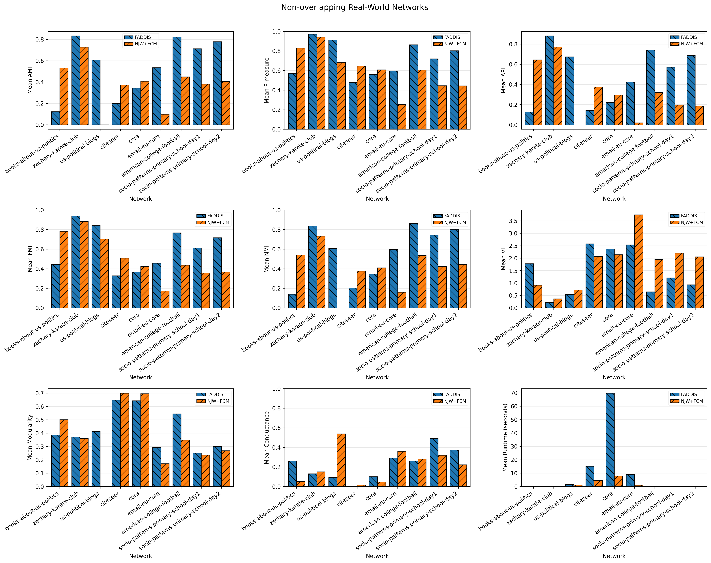
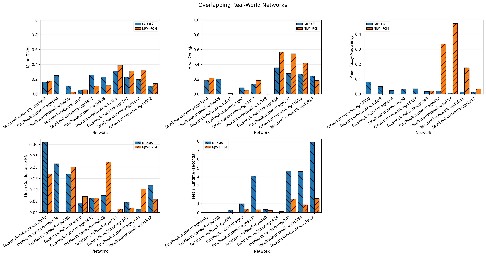

# Report 16 - Spectral Baseline Comparison Design and Results

## Table of Contents

- [Pipeline](#pipeline)
- [Considered Methods](#considered-methods)
- [FADDIS versus NJW+FCM](#faddis-versus-njwfcm)
- [FADDIS Hyperparameters](#faddis-hyperparameters)
- [NJW+FCM Hyperparameters](#njwfcm-hyperparameters)
  - [NJW](#njw)
  - [FCM](#fcm)
- [Results](#results)

## Pipeline

## Considered Methods
   
- NJW+FCM

## FADDIS versus NJW+FCM

1. Select the networks:
   - Real world network with ground-truth.

2. Construct the affinity matrix:
   - Default affinity matrix, i.e., the adjacency matrix.

3. Do not apply sparsification.

4. Use the LAPIN-off execution mode.

5. Use the ground-truth number of communities, $K$:
   - As the stopping criterion for FADDIS;
   - As the number of clusters for NJW+FCM.

6. Execute:
   - FADDIS;
   - NJW + FCM.

7. Apply the defuzzification rule according to the ground-truth type:
   - For non-overlapping ground-truth, apply maximum-membership assignment;
   - For overlapping ground-truth: 
      - Apply node-wise $\alpha$-cut thresholding relative to the maximum membership value, with $\gamma$ hyperparameter, for FADDIS. This is not theoretically and empirical applicable to NJW+FCM because the memberships of each node sum to 1;
      - Apply fixed $\psi$-thresholding, with maximum-membership assignment fallback, for NJW+FCM.

8. Evaluate the results using:
   - Extrinsic metrics (AMI, F-measure, ARI, FMI, NMI, VI; ONMI, Omega);
   - Intrinsic metrics (Modularity, Conductance; Fuzzy-Modularity, Conductance-BN);
   - Computational metrics (Runtime (1 (A) -> 7 (Defuzzification)) with multiple runs).

> **Note:** NJW + FCM is non-deterministic and is therefore executed multiple times using different random seeds. The results are reported as the mean ± standard deviation.

## FADDIS Hyperparameters

- Stopping criterion:

  $$
  K = K_{\text{ground-truth}}
  $$

- Defuzzification hyperparameter $\gamma$ (best observed from LFR experiments):

  $$
  \gamma = 0.8
  $$

## NJW+FCM Hyperparameters

### NJW

- Number of clusters:

  $$
  K = K_{\text{ground-truth}}
  $$

- Scaling parameter $\sigma$ (skipped)

- Defuzzification threshold $\psi$ (reference value):

  $$
  \psi = 0.1
  $$

### FCM

- Fuzziness parameter (default):

  $$
  m = 2.0
  $$

- Convergence tolerance (default):

  $$
  e = 10^{-5}
  $$

- Maximum number of iterations (default):

  $$
  t_{\max} = 100
  $$

- Seeds:

$$
   [0, 1, 2]
$$

## Results

- [Results](../../../results/real-world/stage2/spectral-baseline/results_2026-07-28_00-19-10-252503/real_world_spectral_comparison_results.csv)
- [Summary](../../../results/real-world/stage2/spectral-baseline/results_2026-07-28_00-19-10-252503/real_world_spectral_comparison_summary.csv)

- [Overlapping Real-World Networks Plot ($\gamma = 0.5$)](../../../results/real-world/stage2/spectral-baseline/results_2026-07-28_19-09-24-292455/overlapping_real_world_spectral_algorithms.png)

- [Overlapping Real-World Networks Plot ($\gamma = 0.3$)](../../../results/real-world/stage2/spectral-baseline/results_2026-07-28_19-24-47-069592/overlapping_real_world_spectral_algorithms.png)