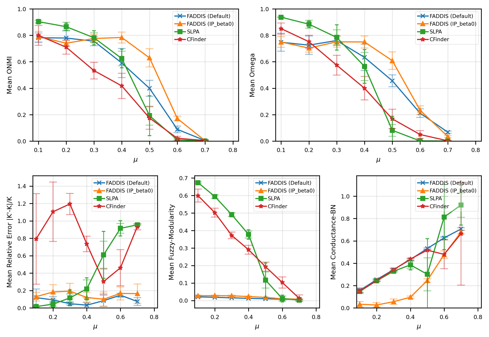
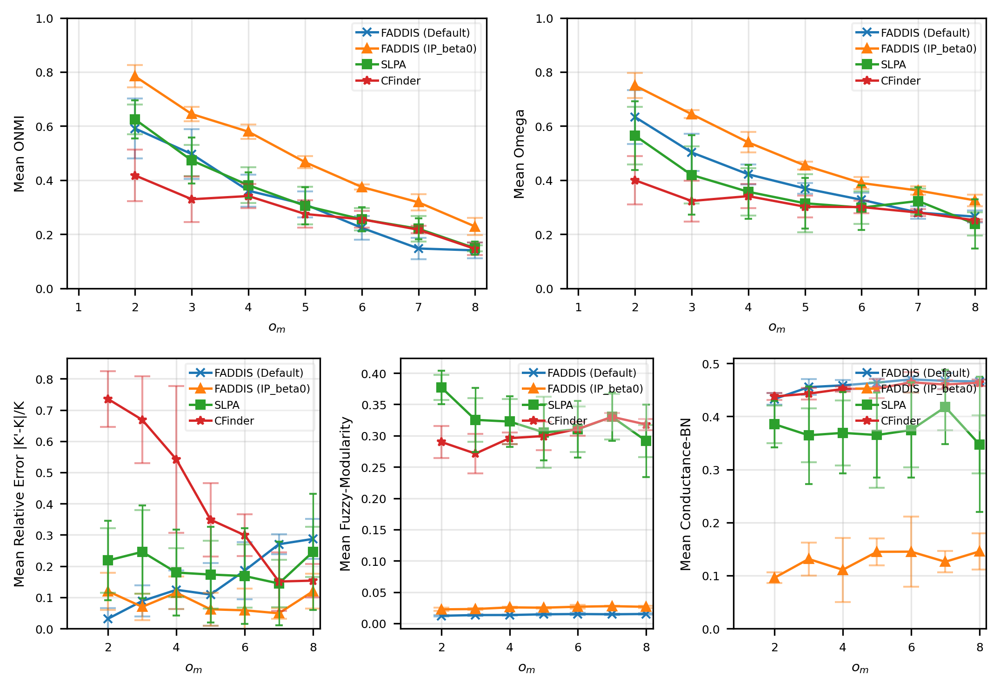
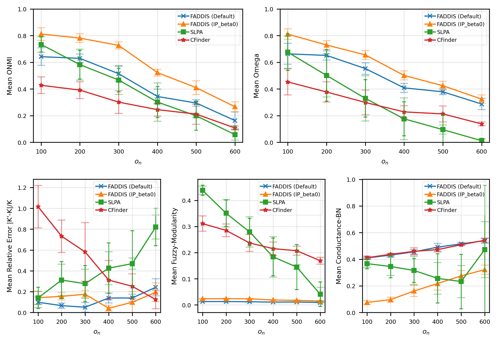

# Report 11 - Non-Spectral Baseline Comparison Design and Results

## Table of Contents

- [Pipeline](#pipeline)
- [Considered Methods](#considered-methods)
- [FADDIS versus SLPA versus CFinder](#faddis-versus-slpa-versus-cfinder)
- [FADDIS Hyperparameters](#faddis-hyperparameters)
- [SLPA Hyperparameters](#slpa-hyperparameters)
- [CFinder Hyperparameters](#cfinder-hyperparameters)
- [Results](#results)
  - [Boundary Variation Set](#boundary-variation-set)
  - [Membership Variation Set](#membership-variation-set)
  - [Overlap Variation Set](#overlap-variation-set)

## Pipeline

## Considered Methods

- SLPA;
- CFinder.

## FADDIS versus SLPA versus CFinder

1. Select the networks:
   - LFR boundary-test-set networks.

2. Configure each method as follows:

   ### FADDIS

   - Construct the affinity matrix:
     - Default affinity matrix, i.e., the adjacency matrix;
     - Alternative best-observed affinity design IP ($\beta=0$).
   - Do not apply sparsification;
   - Use the LAPIN-off execution mode;
   - Set the threshold $\tau$;
   - Set the threshold $\epsilon$;
   - Set the threshold $k_{max}$.

   ### SLPA

   - Set the maximum number of iterations, $t$;
   - Set the post-processing threshold, $r$.

   ### CFinder

   - Set the size of the cliques, $k$.

3. Execute:
   - FADDIS;
   - SLPA;
   - CFinder.

4. For FADDIS, apply the defuzzification rule according to the ground-truth type:
   - For overlapping ground-truth, apply node-wise $\alpha$-cut thresholding relative to the maximum membership value, with $\gamma$ hyperparameter.

5. Evaluate the results using:
   - Extrinsic metrics (ONMI, Omega);
   - Computational metrics (Runtime (1 (A) -> 4 (Defuzzification)) with multiple runs).

> **Note:** SLPA is non-deterministic and is therefore executed multiple times using different random seeds. The results are reported as the mean ± standard deviation.

## FADDIS Hyperparameters

- Threshold $k_{max}$:

  $$
  K_{max} = \min(n/2, 500)
  $$

- Threshold $\tau$:

  $$
  \tau = 0.05
  $$

- Threshold $\epsilon$:

  $$
  \epsilon = \text{network family threshold}
  $$

- Defuzzification hyperparameter $\gamma$ (best observed from LFR experiments):

  $$
  \gamma = 0.8
  $$

## SLPA Hyperparameters

- Maximum number of iterations (default):

  $$
  t = 21
  $$

- Post-processing threshold (default):

  $$
  r = 0.1
  $$

- Seeds:

$$
   [0, 1, 2, 3, 4]
$$

## CFinder Hyperparameters

- Size of the cliques (reference value):

  $$
  k = 5
  $$

## Results

### Boundary Variation Set

- [Results](../../results/synthetic/baselines_test/bvs/non-spectral/results_2026-09-17_02-14-19-694023/mu_non_spectral_comparison_results.csv)
- [Summary](../../results/synthetic/baselines_test/bvs/non-spectral/results_2026-09-17_02-14-19-694023/mu_non_spectral_comparison_summary.csv)

### Membership Variation Set

- [Results](../../results/synthetic/baselines_test/mvs/non-spectral/results_2026-09-17_03-55-34-401994/om_non_spectral_comparison_results.csv)
- [Summary](../../results/synthetic/baselines_test/mvs/non-spectral/results_2026-09-17_03-55-34-401994/om_non_spectral_comparison_summary.csv)

### Overlap Variation Set

- [Results](../../results/synthetic/baselines_test/ovs/non-spectral/results_2026-09-17_05-43-17-622005/on_non_spectral_comparison_results.csv)
- [Summary](../../results/synthetic/baselines_test/ovs/non-spectral/results_2026-09-17_05-43-17-622005/on_non_spectral_comparison_summary.csv)

