# Report 2 - Question (Phase I): Using the fine-tuned thresholds, can we obtain competitive results compared to the reference paper Vieira et al. Applied Network Science (2020)?

## Table of Contents

- [Setup](#setup)
- [Scripts](#scripts)
- [Thresholds](#thresholds)
    - [Experience 1 (LAPIN-off + Extraction of K desired clusters)](#experience-1-lapin-off--extraction-of-k-desired-clusters)
    - [Experience 2 (LAPIN-off + Extraction of clusters until the end)](#experience-2-lapin-off--extraction-of-clusters-until-the-end)
    - [Experience 3 (LAPIN-on + Extraction of K desired clusters)](#experience-3-lapin-on--extraction-of-k-desired-clusters)
    - [Experience 4 (LAPIN-on + Extraction of clusters until the end)](#experience-4-lapin-on--extraction-of-clusters-until-the-end)
- [Boundary Variation Set](#boundary-variation-set)
    - [Reference Results](#reference-results)
    - [Experience 1 (LAPIN-off + Extraction of K desired clusters) Results](#experience-1-lapin-off--extraction-of-k-desired-clusters-results)
    - [Experience 2 (LAPIN-off + Extraction of clusters until the end) Results](#experience-2-lapin-off--extraction-of-clusters-until-the-end-results)
    - [Experience 3 (LAPIN-on + Extraction of K desired clusters) Results](#experience-3-lapin-on--extraction-of-k-desired-clusters-results)
    - [Experience 4 (LAPIN-on + Extraction of clusters until the end) Results](#experience-4-lapin-on--extraction-of-clusters-until-the-end-results)
- [Membership Variation Set](#membership-variation-set)
    - [Reference Results](#reference-results-1)
    - [Experience 1 (LAPIN-off + Extraction of K desired clusters) Results](#experience-1-lapin-off--extraction-of-k-desired-clusters-results-1)
    - [Experience 2 (LAPIN-off + Extraction of clusters until the end) Results](#experience-2-lapin-off--extraction-of-clusters-until-the-end-results-1)
    - [Experience 3 (LAPIN-on + Extraction of K desired clusters) Results](#experience-3-lapin-on--extraction-of-k-desired-clusters-results-1)
    - [Experience 4 (LAPIN-on + Extraction of clusters until the end) Results](#experience-4-lapin-on--extraction-of-clusters-until-the-end-results-1)
- [Overlap Variation Set](#overlap-variation-set)
    - [Reference Results](#reference-results-2)
    - [Experience 1 (LAPIN-off + Extraction of K desired clusters) Results](#experience-1-lapin-off--extraction-of-k-desired-clusters-results-2)
    - [Experience 2 (LAPIN-off + Extraction of clusters until the end) Results](#experience-2-lapin-off--extraction-of-clusters-until-the-end-results-2)
    - [Experience 3 (LAPIN-on + Extraction of K desired clusters) Results](#experience-3-lapin-on--extraction-of-k-desired-clusters-results-2)
    - [Experience 4 (LAPIN-on + Extraction of clusters until the end) Results](#experience-4-lapin-on--extraction-of-clusters-until-the-end-results-2)
- [Size Variation Set](#size-variation-set)
    - [Reference Results](#reference-results-3)
    - [Experience 1 (LAPIN-off + Extraction of K desired clusters) Results](#experience-1-lapin-off--extraction-of-k-desired-clusters-results-3)
    - [Experience 2 (LAPIN-off + Extraction of clusters until the end) Results](#experience-2-lapin-off--extraction-of-clusters-until-the-end-results-3)
    - [Experience 3 (LAPIN-on + Extraction of K desired clusters) Results](#experience-3-lapin-on--extraction-of-k-desired-clusters-results-3)
    - [Experience 4 (LAPIN-on + Extraction of clusters until the end) Results](#experience-4-lapin-on--extraction-of-clusters-until-the-end-results-3)
- [Hardware](#hardware)
- [References](#references)

## Setup

### Reference Networks

- Base parameters:
    - $\overline{d}$ = 20
    - $d_{max}$ = 50
    - $c_{min}$ = 20
    - $c_{max}$ = 100
    - $t1$ = -2
    - $t2$ = -1
    - $n$ = 1000
    - $\mu$ = 0.4
    - $o_{n}/n$ = 0.2
    - $o_{m}$ = 2
- Instances per set of parameters: 10
- Boundary Variation Set: $\mu$ $\in$ [0.1, 0.8], step 0.1
- Membership Variation Set: $o_{m}$ $\in$ [1, 8], step 1
- Overlap Variation Set: $o_{n}/n$ $\in$ [0.1, 0.6], step 0.1
- Size Variation Set: $n$ $\in$ [1000, 10000], step 1000

### Networks

- Same base parameters as the reference setup
- Same instances per set of parameters as the reference setup
- Boundary Variation Set: **$\mu$ $\in$ [0.1, 0.6]**, step 0.1
- Membership Variation Set: **$o_{m}$ $\in$ [2, 5]**, step 1
- Overlap Variation Set: **$o_{n}/n$ $\in$ [0.1, 0.4]**, step 0.1
- Size Variation Set: $n$ $\in$ **[500, 1000], step 100**

## Scripts

### Script 1

- For each experience (set of thresholds), apply the pipeline to each network of each variation set and save the results for each network in a .csv file:

1. `LFR synthetic network`
2. `Default (Adjacency matrix)`
3. `Sparsification not applied`
4. `LAPIN-off and LAPIN-on`
5. `epsilon = threshold of the network family; tau = 0.05; k_max = min(100, n/2)`
6. `FADDIS with stop criterion (epsilon, tau, k_max)`
7. `gamma = [0.3, 0.5, 0.6, 0.7, 0.8, 0.9]`
8. `Extrinsic metrics = [Relative Error of K, ONMI, Omega]`

- For each experience (set of thresholds), draw two plots for each variation set showing the mean ONMI and Omega results by the tested variant, identical to the plots of the reference paper. Additionally, plot the relative error of K (number of communities).

## Thresholds

###  Experience 1 (LAPIN-off + Extraction of K desired clusters)

| Network Family    | Selected Metric | Threshold |
|-------------------|-----------------|-----------|
| 01_nL_uL_onnL_omL | Median          | 7.7e-05   |
| 02_nL_uL_onnL_omM | Median          | 7e-05     |
| 03_nL_uL_onnM_omL | Median          | 3.9e-05   |
| 04_nL_uL_onnM_omM | Median          | 2e-05     |
| 05_nL_uM_onnL_omL | Median          | 1.9e-05   |
| 06_nL_uM_onnL_omM | Median          | 1.6e-05   |
| 07_nL_uM_onnM_omL | Median          | 8e-06     |
| 08_nL_uM_onnM_omM | Median          | 3e-06     |
| 09_nM_uL_onnL_omL | Median          | 5.3e-05   |
| 10_nM_uL_onnL_omM | Median          | 4.4e-05   |
| 11_nM_uL_onnM_omL | Median          | 2.1e-05   |
| 12_nM_uL_onnM_omM | Median          | 8e-06     |
| 13_nM_uM_onnL_omL | Median          | 1.1e-05   |
| 14_nM_uM_onnL_omM | Median          | 8e-06     |
| 15_nM_uM_onnM_omL | Median          | 4e-06     |
| 16_nM_uM_onnM_omM | Median          | 2e-06     |

### Experience 2 (LAPIN-off + Extraction of clusters until the end)

| Network Family    | Selected Metric | Threshold |
|-------------------|-----------------|-----------|
| 01_nL_uL_onnL_omL | Median          | 5.8e-05   |
| 02_nL_uL_onnL_omM | Median          | 6e-05     |
| 03_nL_uL_onnM_omL | Median          | 2.9e-05   |
| 04_nL_uL_onnM_omM | Median          | 1.5e-05   |
| 05_nL_uM_onnL_omL | Median          | 6e-06     |
| 06_nL_uM_onnL_omM | Median          | 8e-06     |
| 07_nL_uM_onnM_omL | Median          | 3e-06     |
| 08_nL_uM_onnM_omM | Median          | 2e-06     |
| 09_nM_uL_onnL_omL | Median          | 4.4e-05   |
| 10_nM_uL_onnL_omM | Median          | 3.5e-05   |
| 11_nM_uL_onnM_omL | Median          | 1.6e-05   |
| 12_nM_uL_onnM_omM | Median          | 8e-06     |
| 13_nM_uM_onnL_omL | Median          | 6e-06     |
| 14_nM_uM_onnL_omM | Median          | 5e-06     |
| 15_nM_uM_onnM_omL | Median          | 3e-06     |
| 16_nM_uM_onnM_omM | Median          | 1e-06     |

### Experience 3 (LAPIN-on + Extraction of K desired clusters)

| Network Family    | Selected Metric | Threshold |
|-------------------|-----------------|-----------|
| 01_nL_uL_onnL_omL | Median          | 8.9e-05   |
| 02_nL_uL_onnL_omM | Median          | 8.1e-05   |
| 03_nL_uL_onnM_omL | Median          | 4.2e-05   |
| 04_nL_uL_onnM_omM | Median          | 3.1e-05   |
| 05_nL_uM_onnL_omL | Median          | 2e-05     |
| 06_nL_uM_onnL_omM | Median          | 1.3e-05   |
| 07_nL_uM_onnM_omL | Median          | 1.1e-05   |
| 08_nL_uM_onnM_omM | Median          | 5e-06     |
| 09_nM_uL_onnL_omL | Median          | 4.3e-05   |
| 10_nM_uL_onnL_omM | Median          | 4.1e-05   |
| 11_nM_uL_onnM_omL | Median          | 1.7e-05   |
| 12_nM_uL_onnM_omM | Median          | 1.4e-05   |
| 13_nM_uM_onnL_omL | Median          | 7e-06     |
| 14_nM_uM_onnL_omM | Median          | 4e-06     |
| 15_nM_uM_onnM_omL | Median          | 3e-06     |
| 16_nM_uM_onnM_omM | Median          | 2e-06     |

### Experience 4 (LAPIN-on + Extraction of clusters until the end)

| Network Family    | Selected Metric | Threshold |
|-------------------|-----------------|-----------|
| 01_nL_uL_onnL_omL | Median          | 1.6e-05   |
| 02_nL_uL_onnL_omM | Median          | 4.5e-05   |
| 03_nL_uL_onnM_omL | Median          | 1.7e-05   |
| 04_nL_uL_onnM_omM | Median          | 2.4e-05   |
| 05_nL_uM_onnL_omL | Median          | 2e-06     |
| 06_nL_uM_onnL_omM | Median          | 2e-06     |
| 07_nL_uM_onnM_omL | Median          | 2e-06     |
| 08_nL_uM_onnM_omM | Median          | 2e-06     |
| 09_nM_uL_onnL_omL | Median          | 2.1e-05   |
| 10_nM_uL_onnL_omM | Median          | 2.4e-05   |
| 11_nM_uL_onnM_omL | Median          | 1e-05     |
| 12_nM_uL_onnM_omM | Median          | 1.3e-05   |
| 13_nM_uM_onnL_omL | Median          | 2e-06     |
| 14_nM_uM_onnL_omM | Median          | 2e-06     |
| 15_nM_uM_onnM_omL | Median          | 2e-06     |
| 16_nM_uM_onnM_omM | Median          | 2e-06     |

## Boundary Variation Set

### Reference Results

### Experience 1 (LAPIN-off + Extraction of K desired clusters) Results

[Open Folder](../../results/synthetic/validation/bvs/experience1_cluster/results_2026-04-10_13-16-21-594342/)

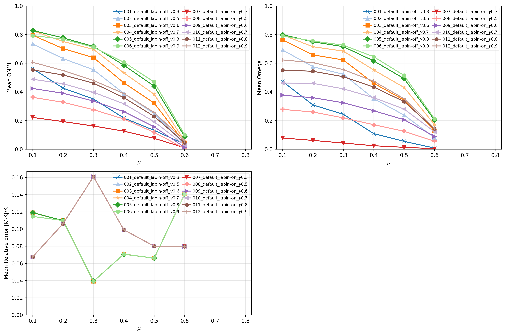

- **Observations**
    - "Best" variants
        - 005_default_lapin-off_-_g0.8
        - 006_default_lapin-off_-_g0.9
    - Stop Condition
        - epsilon or W
    - $\mu$ = 0.1
        - [ONMI] Copra
        - [Omega] Copra
    - $\mu$ = 0.2
        - [ONMI] Copra
        - [Omega] Copra
    - $\mu$ = 0.3 
        - [ONMI] **FADDIS**/Copra
        - [Omega] **FADDIS**/Copra
    - $\mu$ = 0.4 
        - [ONMI] **FADDIS**
        - [Omega] **FADDIS**
    - $\mu$ = 0.5
        - [ONMI] **FADDIS**
        - [Omega] **FADDIS**
    - $\mu$ = 0.6 
        - [ONMI] **FADDIS**/CFinder
        - [Omega] **FADDIS**

### Experience 2 (LAPIN-off + Extraction of clusters until the end) Results

[Open Folder](../../results/synthetic/validation/bvs/experience2_cluster/results_2026-04-10_18-46-27-529048/)

### Experience 3 (LAPIN-on + Extraction of K desired clusters) Results

[Open Folder](../../results/synthetic/validation/bvs/experience3_cluster/results_2026-04-10_21-39-07-593414/)

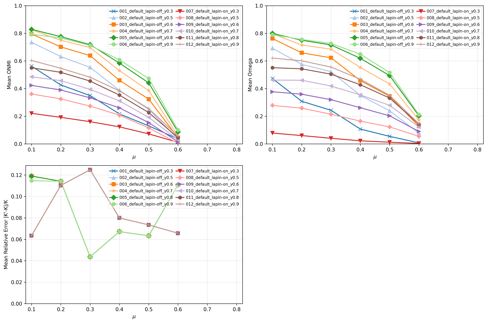

### Experience 4 (LAPIN-on + Extraction of clusters until the end) Results

[Open Folder](../../results/synthetic/validation/bvs/experience4_cluster/results_2026-04-11_00-08-06-619023/)

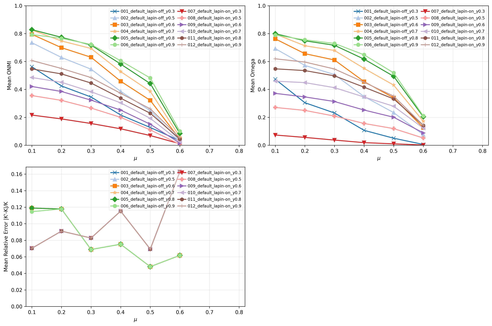

## Membership Variation Set

### Reference Results

### Experience 1 (LAPIN-off + Extraction of K desired clusters) Results

[Open Folder](../../results/synthetic/validation/mvs/experience1_cluster/results_2026-04-11_11-39-05-745642/)

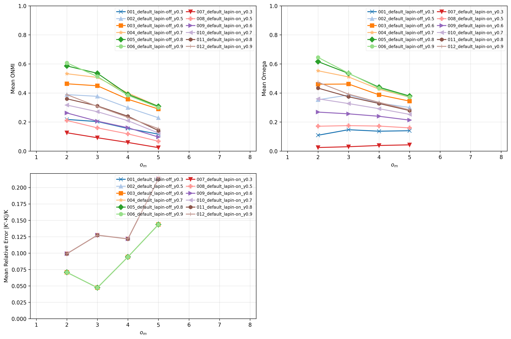

- **Observations**
    - "Best" variants
        - 005_default_lapin-off_-_g0.8
        - 006_default_lapin-off_-_g0.9
    - Stop Condition
        - epsilon or W
    - $o_{m}$ = 2
        - [ONMI] **FADDIS**
        - [Omega] **FADDIS**
    - $o_{m}$ = 3
        - [ONMI] **FADDIS**
        - [Omega] **FADDIS**
    - $o_{m}$ = 4
        - [ONMI] **FADDIS**/CFinder
        - [Omega] **FADDIS**
    - $o_{m}$ = 5 
        - [ONMI] CFinder
        - [Omega] **FADDIS**

### Experience 2 (LAPIN-off + Extraction of clusters until the end) Results

[Open Folder](../../results/synthetic/validation/mvs/experience2_cluster/results_2026-04-11_23-31-55-403981/)

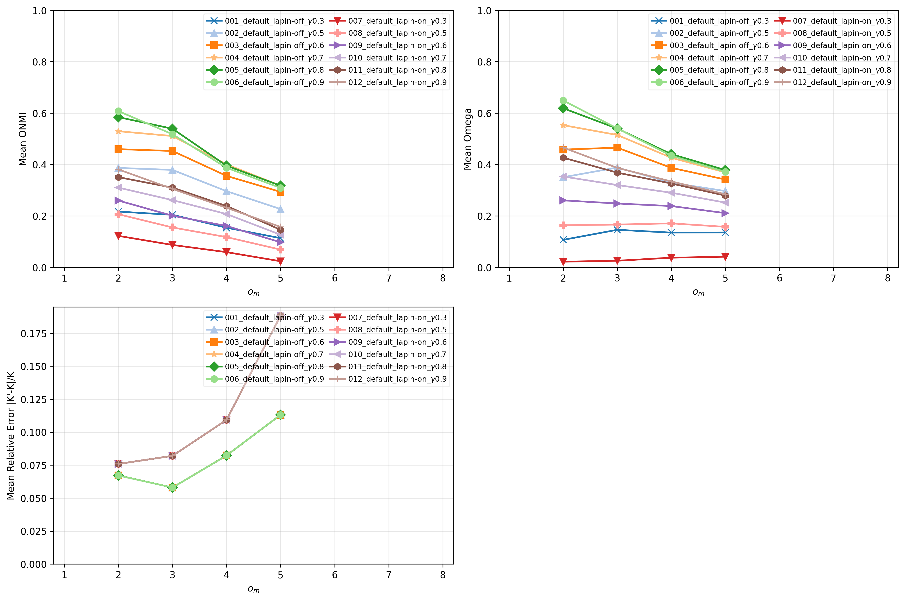

### Experience 3 (LAPIN-on + Extraction of K desired clusters) Results

[Open Folder](../../results/synthetic/validation/mvs/experience3_cluster/results_2026-04-12_09-50-03-559581/)

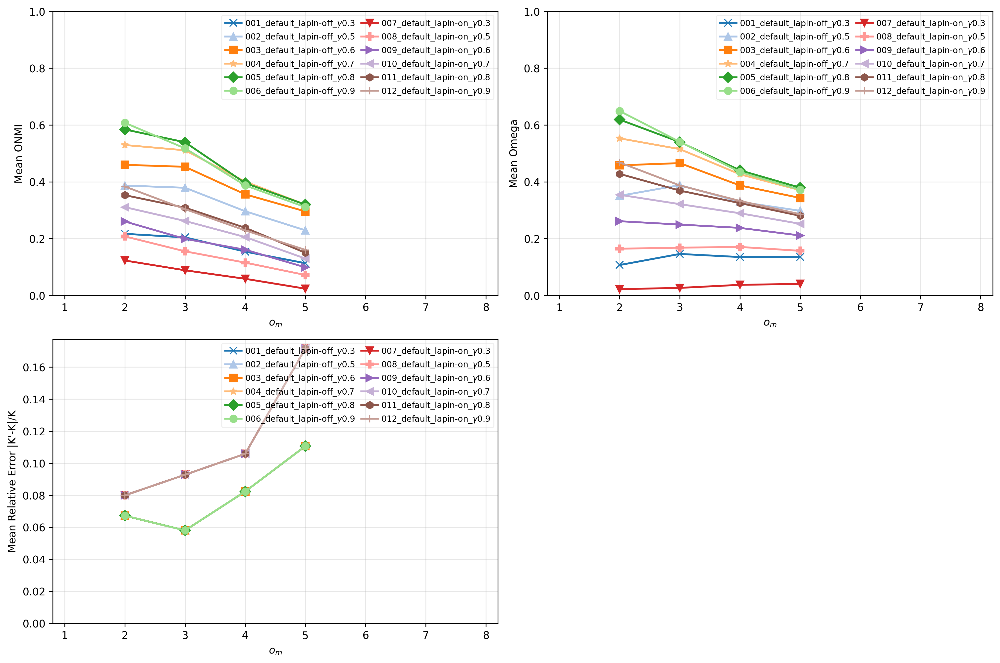

### Experience 4 (LAPIN-on + Extraction of clusters until the end) Results

[Open Folder](../../results/synthetic/validation/mvs/experience4_cluster/results_2026-04-12_11-35-17-967624/)

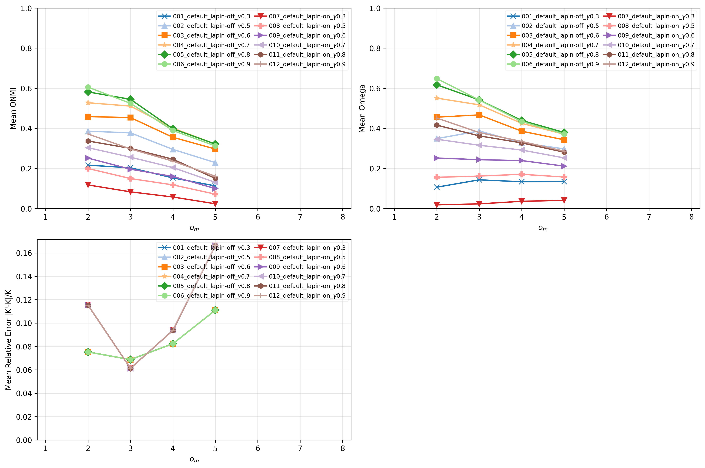

## Overlap Variation Set

### Reference Results

### Experience 1 (LAPIN-off + Extraction of K desired clusters) Results

[Open Folder](../../results/synthetic/validation/ovs/experience1_cluster/results_2026-04-12_13-46-36-158854/)

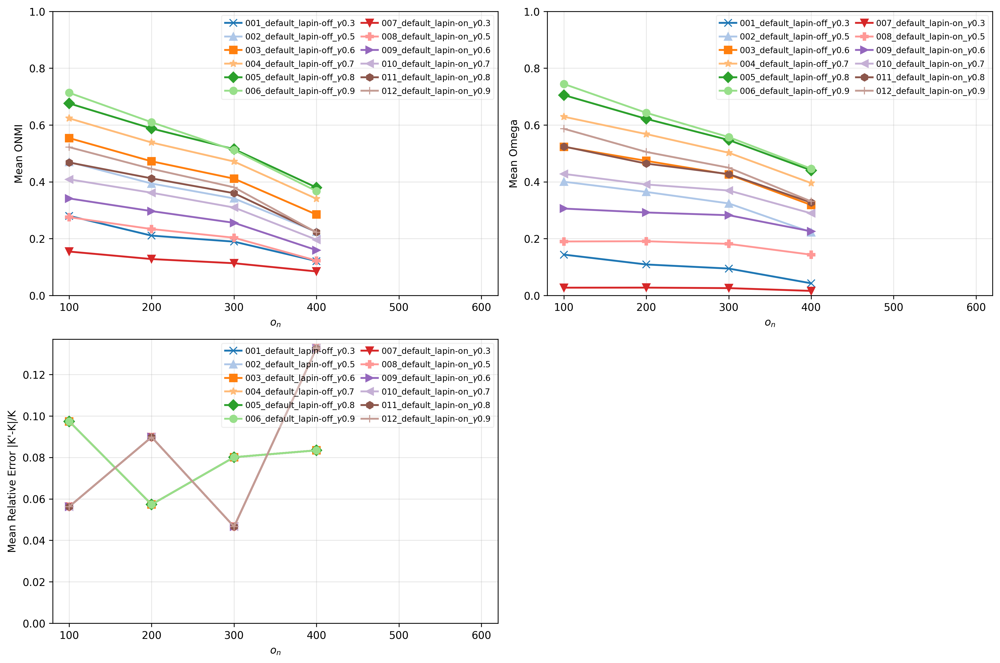

- **Observations**
    - "Best" variants
        - 005_default_lapin-off_-_g0.8
        - 006_default_lapin-off_-_g0.9
    - Stop Condition
        - epsilon or W
    - $o_{n}/n$ = 0.1
        - [ONMI] **FADDIS**
        - [Omega]  **FADDIS**
    - $o_{n}/n$ = 0.2
        - [ONMI] **FADDIS**
        - [Omega] **FADDIS**
    - $o_{n}/n$ = 0.3
        - [ONMI] **FADDIS**
        - [Omega] **FADDIS**
    - $o_{n}/n$ = 0.4 
        - [ONMI] **FADDIS**/CFinder
        - [Omega] **FADDIS**

### Experience 2 (LAPIN-off + Extraction of clusters until the end) Results

[Open Folder](../../results/synthetic/validation/ovs/experience2_cluster/results_2026-04-12_15-41-47-330370/)

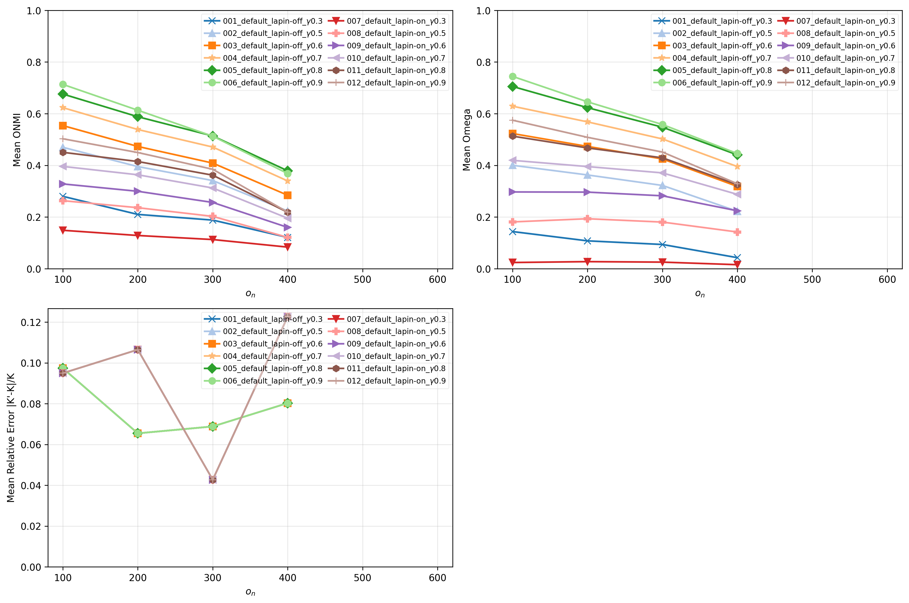

### Experience 3 (LAPIN-on + Extraction of K desired clusters) Results

[Open Folder](../../results/synthetic/validation/ovs/experience3_cluster/results_2026-04-12_17-17-12-630419/)

### Experience 4 (LAPIN-on + Extraction of clusters until the end) Results

[Open Folder](../../results/synthetic/validation/ovs/experience4_cluster/results_2026-04-12_18-47-18-341627/)

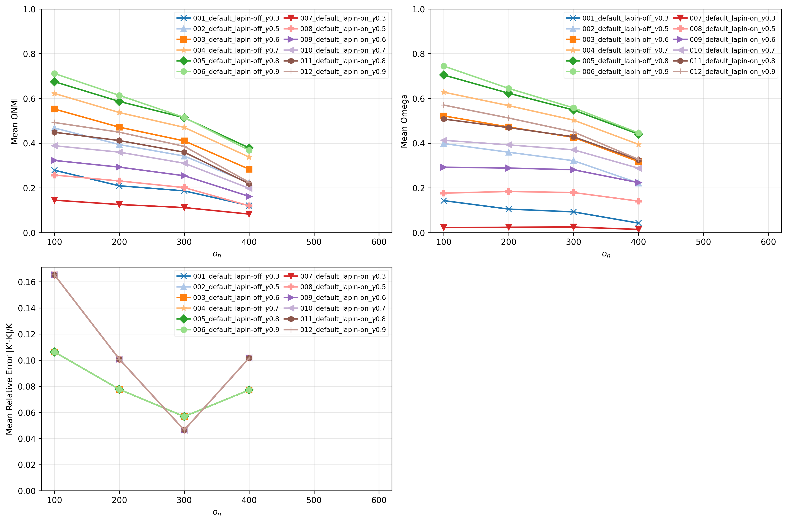

## Size Variation Set

### Reference Results

### Experience 1 (LAPIN-off + Extraction of K desired clusters) Results

[Open Folder](../../results/synthetic/validation/svs/experience1_cluster/results_2026-04-12_20-42-10-997187/)

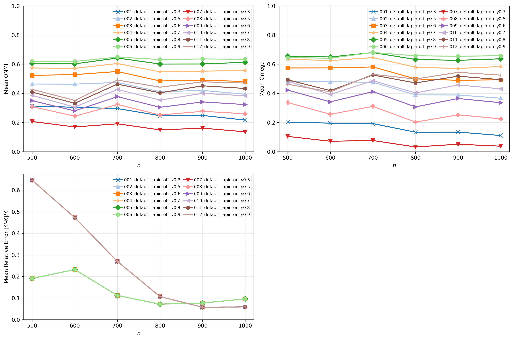

- **Observations**
    - "Best" variants
        - 005_default_lapin-off_-_g0.8
        - 006_default_lapin-off_-_g0.9
    - Stop Condition
        - epsilon or W
    - $n$ = 1000
        - [ONMI] **FADDIS**
        - [Omega] **FADDIS**  

### Experience 2 (LAPIN-off + Extraction of clusters until the end) Results

[Open Folder](../../results/synthetic/validation/svs/experience2_cluster/results_2026-04-13_19-12-06-974844/)

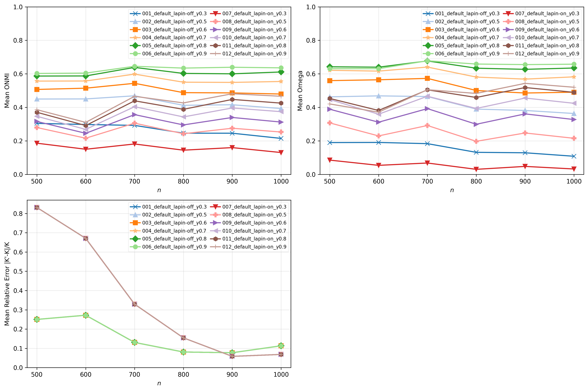

### Experience 3 (LAPIN-on + Extraction of K desired clusters) Results

[Open Folder](../../results/synthetic/validation/svs/experience3_cluster/results_2026-04-14_10-15-07-924997/)

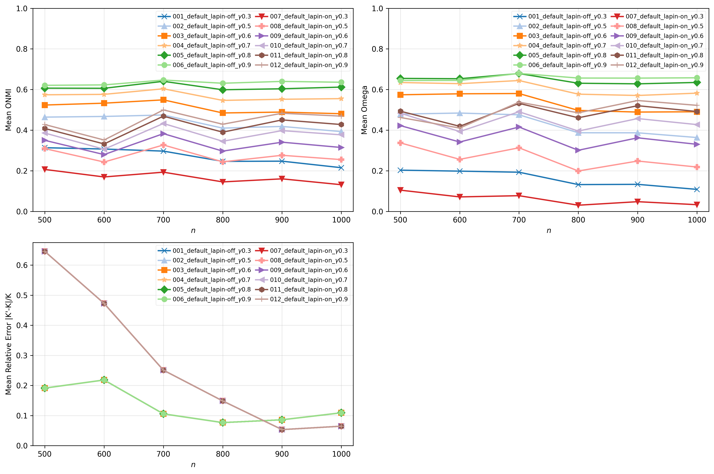

### Experience 4 (LAPIN-on + Extraction of clusters until the end) Results

[Open Folder](../../results/synthetic/validation/svs/experience4_cluster/results_2026-04-14_17-27-01-073540/)

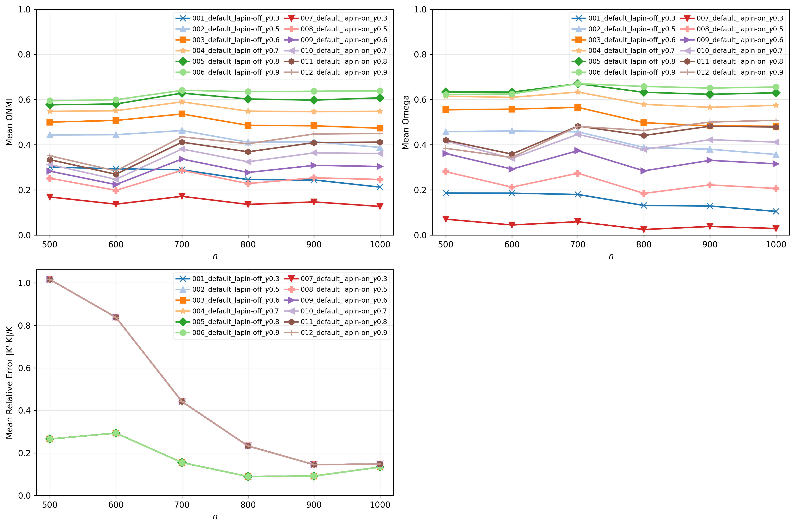

## Hardware

## References

[1] V. da Fonseca Vieira, C. R. Xavier, and A. G. Evsukoff. “A comparative study of
overlapping community detection methods from the perspective of the structural
properties”. In: Applied Network Science 5 (2020), p. 51. doi: 10.1007/s41109-020-
00289-9.