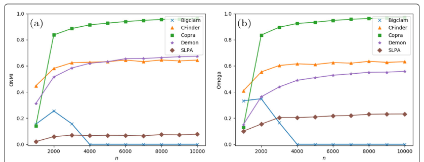
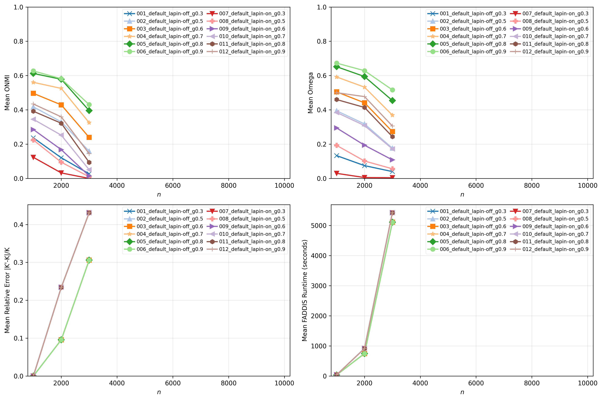
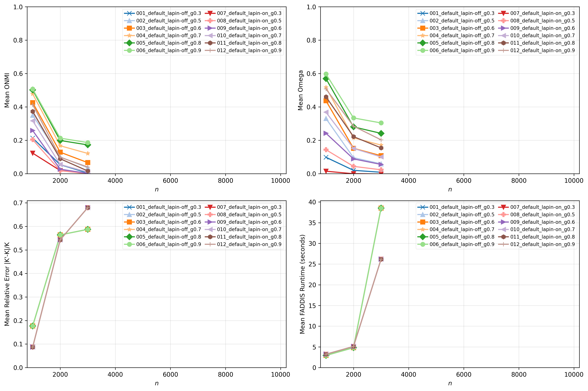
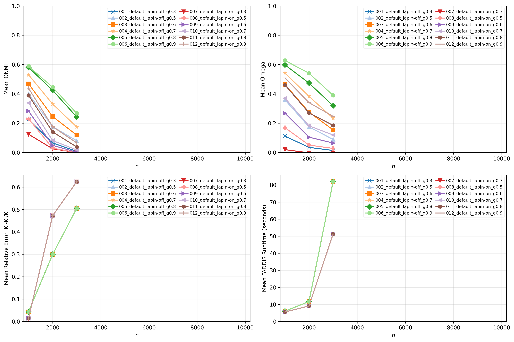
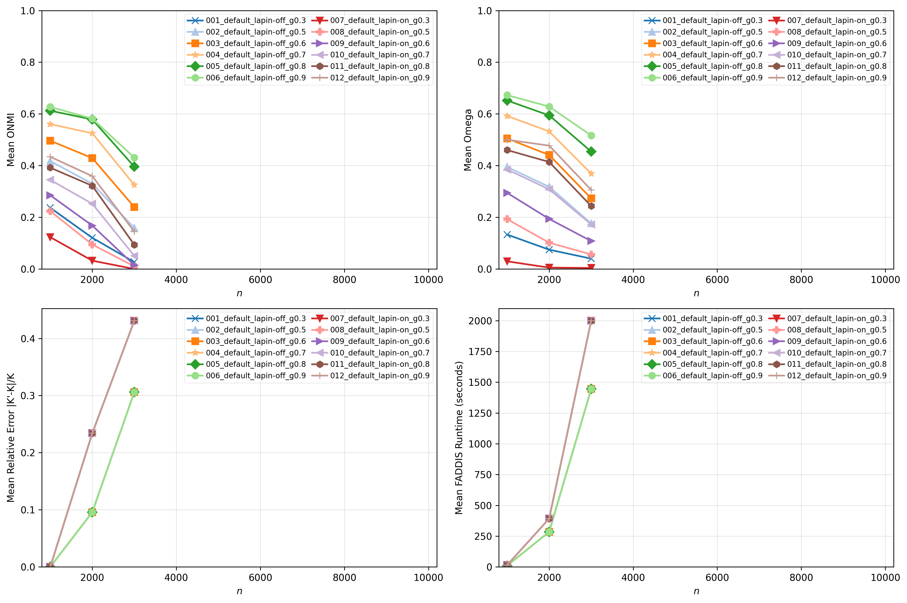

# Report 4 - Experiments of FADDIS versions on large-networks

## Table of Contents

- [Setup](#setup)
- [Scripts](#scripts)
- [Size Variation Set](#size-variation-set)
  - [Reference Results](#reference-results)
  - [Experience with FADDIS version-a (GOT)](#experience-with-faddis-version-a-got)
  - [Experience with FADDIS version-m](#experience-with-faddis-version-m)
  - [Experience with FADDIS version-a top-10](#experience-with-faddis-version-a-top-10)
  - [Experience with FADDIS version-a (Improved)](#experience-with-faddis-version-a-improved)
- [Hardware](#hardware)
- [Discussion](#discussion)
- [References](#references)


## Setup

### Reference Networks


- Base parameters:
    - $\overline{d}$ = 20
    - $d_{max}$ = 50
    - $c_{min}$ = 20
    - $c_{max}$ = 100
    - $t1$ = -2
    - $t2$ = -1
    - $n$ = 1000
    - $\mu$ = 0.4
    - $o_{n}/n$ = 0.2
    - $o_{m}$ = 2
- Instances per set of parameters: 10
- Size Variation Set: $n$ $\in$ [1000, 10000], step 1000


### Networks

- Same base parameters as the reference setup
- Instances per set of parameters: **2** and **3**
- Same Variation Set


## Scripts

### Script 1

- For each experience (set of thresholds), apply the pipeline to each network of each variation set and save the results for each network in a .csv file:


1. `LFR synthetic network`
2. `Default (Adjacency matrix)`
3. `Sparsification not applied`
4. `LAPIN-off and LAPIN-on`
5. `desired_k = K + 1 if LAPIN-off else K`
6. `FADDIS with stop criterion (desired_k)`
7. `gamma = [0.3, 0.5, 0.6, 0.7, 0.8, 0.9]`
8. `Extrinsic metrics = [Relative Error of K, ONMI, Omega]`

- For each experience (set of thresholds), draw two plots for each variation set showing the mean ONMI and Omega results by the tested variant, identical to the plots of the reference paper. Additionally, plot the relative error of K (number of communities) and the mean runtime of FADDIS.


## Size Variation Set

### Reference Results




### Experience with FADDIS version-a (GOT)

```python
sequence_of_matrices = []
curr_eigenvalues, curr_eigenvectors = numpy.linalg.eig(Wt)
```

[Open Folder](../../results/synthetic/size_variation_set/faddis_version_a_got/results_2026-04-20_08-40-19-143228/)




### Experience with FADDIS version-m

```python
# sequence_of_matrices = []
curr_eigenvalues, curr_eigenvectors = numpy.linalg.eigsh(np.asarray(Wt), k=1, which="LA")
```


[Open Folder](../../results/synthetic/size_variation_set/faddis_version_m/results_2026-04-26_00-05-03-708303/)




### Experience with FADDIS version-a top-10

```python
# sequence_of_matrices = []
curr_eigenvalues, curr_eigenvectors = numpy.linalg.eigsh(np.asarray(Wt), k=10, which="LA")
```

[Open Folder](../../results/synthetic/size_variation_set/faddis_version_a_top_10/results_2026-04-26_08-24-20-677914/)




### Experience with FADDIS version-a (Improved)

```python
# sequence_of_matrices = []
curr_eigenvalues, curr_eigenvectors = numpy.linalg.eigh(Wt)
```

[Open Folder](../../results/synthetic/size_variation_set/faddis_version_a_improved/results_2026-04-30_00-23-38-440972/)




## Hardware


## Discussion

- **Observations**
  - **FADDIS version-m** significantly reduced the runtime compared to **FADDIS version-a (GOT)**, but the results showed a substantial downgrade. Therefore, it was excluded;
  - **FADDIS version-a top-e** reduced the runtime compared to **FADDIS version-a (GOT)** and slightly more than **FADDIS version-m**, but the results also showed a downgrade. However, it may perform well with further optimization improvements. Therefore, it will be considered as future work for optimizations: fine-tuning top-e, updating all FADDIS code to use recent and faster implementations and using GPUs;
  - **FADDIS version-a (Improved)** maintained the results of **FADDIS version-a (GOT)**, as expected, since the behaviour of FADDIS does not change. The runtime was better than **FADDIS version-a (GOT)** and worse than **FADDIS version-m** and **FADDIS version-a top-e**. Therefore, it was the most balanced option and will be explored and used in the next stages.


## References

[1] V. da Fonseca Vieira, C. R. Xavier, and A. G. Evsukoff. “A comparative study of
overlapping community detection methods from the perspective of the structural
properties”. In: Applied Network Science 5 (2020), p. 51. doi: 10.1007/s41109-020-
00289-9.