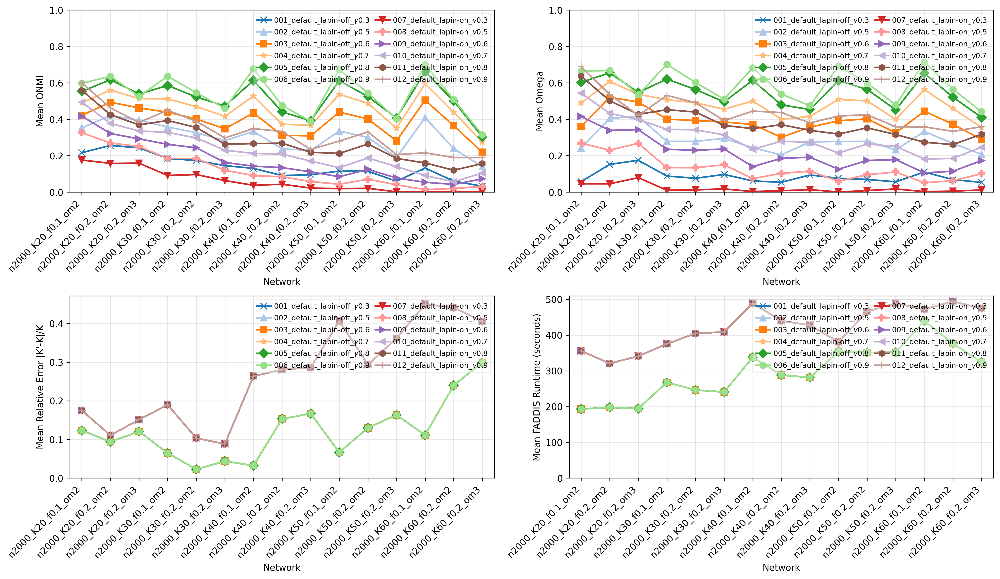
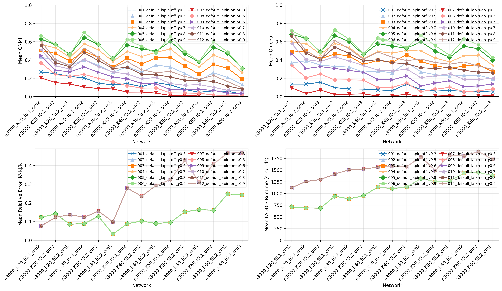
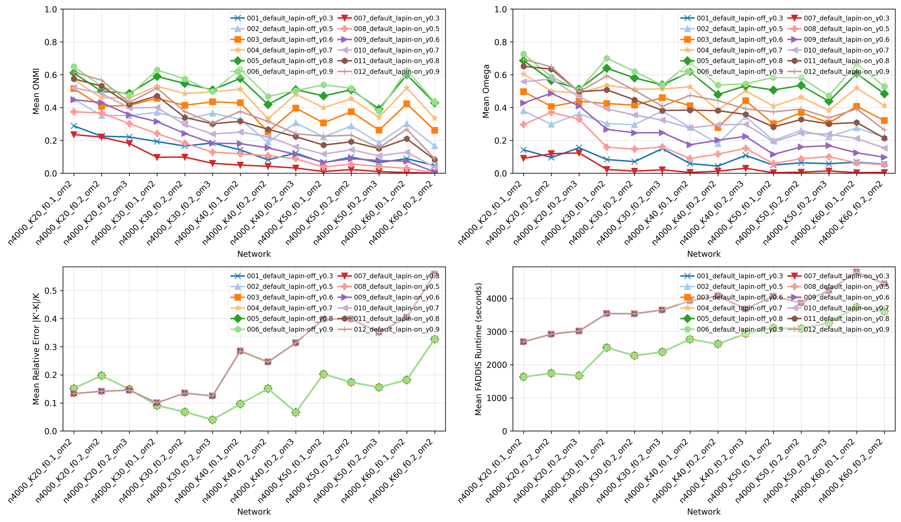

# Report 7 - Experiments on large-networks with a new LFR setup

## Table of Contents

- [Networks](#networks)
- [Scripts](#scripts)
- [Experience 9 (LAPIN-off + Extraction of K desired clusters)](#experience-9-lapin-off--extraction-of-k-desired-clusters)
    - [Thresholds](#thresholds)
    - [`n2000`](#n2000)
    - [`n3000`](#n3000)
    - [`n4000`](#n4000)
- [Hardware](#hardware)
- [Discussion](#discussion)

## Networks

- $\overline{d}$ = 20
- $d_{max}$ = 50
- $t1$ = -2
- $t2$ = -1
- $\mu$ = 0.4
- $n$ = {2000, 3000, 4000}
- ($o_{n}/n$, $o_{m}$) = ($f$, $o_{m}$) = {(0.1, 2), (0.2, 2), (0.2, 3)}
- $K$ = {20, 30, 40, 50, 60}
- $t$ = 3

- Community-size rules:
    - $c_{avg}$ = $n * [1 + f * (o_{m} - 1)] / K$
    - $c_{min} = 0.4 * c_{avg}$
    - $c_{max} = 2 * c_{avg}$

- Network Family: **64_nH_uM_onnL_omL**

| Network | $K$ | $f$ | $om$ | $c_{avg}$ | $c_{min}$ | $c_{max}$ |
|---|---:|---:|---:|---:|---:|---:|
| `n2000_K20_f0.1_om2` | 20 | 0.10 | 2 | 110 | 44 | 220 |
| `n2000_K20_f0.2_om2` | 20 | 0.20 | 2 | 120 | 48 | 240 |
| `n2000_K20_f0.2_om3` | 20 | 0.20 | 3 | 140 | 56 | 280 |
| `n2000_K30_f0.1_om2` | 30 | 0.10 | 2 | 73 | 29 | 147 |
| `n2000_K30_f0.2_om2` | 30 | 0.20 | 2 | 80 | 32 | 160 |
| `n2000_K30_f0.2_om3` | 30 | 0.20 | 3 | 93 | 37 | 187 |
| `n2000_K40_f0.1_om2` | 40 | 0.10 | 2 | 55 | 22 | 110 |
| `n2000_K40_f0.2_om2` | 40 | 0.20 | 2 | 60 | 24 | 120 |
| `n2000_K40_f0.2_om3` | 40 | 0.20 | 3 | 70 | 28 | 140 |
| `n2000_K50_f0.1_om2` | 50 | 0.10 | 2 | 44 | 18 | 88 |
| `n2000_K50_f0.2_om2` | 50 | 0.20 | 2 | 48 | 19 | 96 |
| `n2000_K50_f0.2_om3` | 50 | 0.20 | 3 | 56 | 22 | 112 |
| `n2000_K60_f0.1_om2` | 60 | 0.10 | 2 | 37 | 15 | 73 |
| `n2000_K60_f0.2_om2` | 60 | 0.20 | 2 | 40 | 16 | 80 |
| `n2000_K60_f0.2_om3` | 60 | 0.20 | 3 | 47 | 19 | 93 |
| `n3000_K20_f0.1_om2` | 20 | 0.10 | 2 | 165 | 66 | 330 |
| `n3000_K20_f0.2_om2` | 20 | 0.20 | 2 | 180 | 72 | 360 |
| `n3000_K20_f0.2_om3` | 20 | 0.20 | 3 | 210 | 84 | 420 |
| `n3000_K30_f0.1_om2` | 30 | 0.10 | 2 | 110 | 44 | 220 |
| `n3000_K30_f0.2_om2` | 30 | 0.20 | 2 | 120 | 48 | 240 |
| `n3000_K30_f0.2_om3` | 30 | 0.20 | 3 | 140 | 56 | 280 |
| `n3000_K40_f0.1_om2` | 40 | 0.10 | 2 | 83 | 33 | 165 |
| `n3000_K40_f0.2_om2` | 40 | 0.20 | 2 | 90 | 36 | 180 |
| `n3000_K40_f0.2_om3` | 40 | 0.20 | 3 | 105 | 42 | 210 |
| `n3000_K50_f0.1_om2` | 50 | 0.10 | 2 | 66 | 26 | 132 |
| `n3000_K50_f0.2_om2` | 50 | 0.20 | 2 | 72 | 29 | 144 |
| `n3000_K50_f0.2_om3` | 50 | 0.20 | 3 | 84 | 34 | 168 |
| `n3000_K60_f0.1_om2` | 60 | 0.10 | 2 | 55 | 22 | 110 |
| `n3000_K60_f0.2_om2` | 60 | 0.20 | 2 | 60 | 24 | 120 |
| `n3000_K60_f0.2_om3` | 60 | 0.20 | 3 | 70 | 28 | 140 |
| `n4000_K20_f0.1_om2` | 20 | 0.10 | 2 | 220 | 88 | 440 |
| `n4000_K20_f0.2_om2` | 20 | 0.20 | 2 | 240 | 96 | 480 |
| `n4000_K20_f0.2_om3` | 20 | 0.20 | 3 | 280 | 112 | 560 |
| `n4000_K30_f0.1_om2` | 30 | 0.10 | 2 | 147 | 59 | 293 |
| `n4000_K30_f0.2_om2` | 30 | 0.20 | 2 | 160 | 64 | 320 |
| `n4000_K30_f0.2_om3` | 30 | 0.20 | 3 | 187 | 75 | 373 |
| `n4000_K40_f0.1_om2` | 40 | 0.10 | 2 | 110 | 44 | 220 |
| `n4000_K40_f0.2_om2` | 40 | 0.20 | 2 | 120 | 48 | 240 |
| `n4000_K40_f0.2_om3` | 40 | 0.20 | 3 | 140 | 56 | 280 |
| `n4000_K50_f0.1_om2` | 50 | 0.10 | 2 | 88 | 35 | 176 |
| `n4000_K50_f0.2_om2` | 50 | 0.20 | 2 | 96 | 38 | 192 |
| `n4000_K50_f0.2_om3` | 50 | 0.20 | 3 | 112 | 45 | 224 |
| `n4000_K60_f0.1_om2` | 60 | 0.10 | 2 | 73 | 29 | 147 |
| `n4000_K60_f0.2_om2` | 60 | 0.20 | 2 | 80 | 32 | 160 |
| `n4000_K60_f0.2_om3` | 60 | 0.20 | 3 | 93 | 37 | 187 |

## Scripts

### Script 1

- For experience 9 (thresholds), apply the pipeline to each network and save the results for each network in a .csv file:

1. `LFR synthetic network`
2. `Default (Adjacency matrix)`
3. `Sparsification not applied`
4. `LAPIN-off and LAPIN-on`
5. `epsilon = threshold of the network family; tau = 0.05; k_max = min(100, n/2)`
6. `FADDIS with stop criterion (epsilon, tau, k_max)`
7. `gamma = [0.3, 0.5, 0.6, 0.7, 0.8, 0.9]`
8. `Extrinsic metrics = [Relative Error of K, ONMI, Omega]`

- For each scale of number of nodes, draw two plots showing the mean ONMI and Omega results by the tested network. Additionally, plot the relative error of K (number of communities) and the mean runtime of FADDIS.

## Experience 9 (LAPIN-off + Extraction of K desired clusters)

### Thresholds 

| Network Family    | Selected Metric | Threshold              |
|-------------------|-----------------|------------------------|
| 01_nL_uL_onnL_omL | Median          | 7.041848604468066e-05  |
| 02_nL_uL_onnL_omM | Median          | 6.371008417602246e-05  |
| 03_nL_uL_onnM_omL | Median          | 3.55225686303996e-05   |
| 04_nL_uL_onnM_omM | Median          | 1.7834634092090344e-05 |
| 05_nL_uM_onnL_omL | Median          | 1.760087854495113e-05  |
| 06_nL_uM_onnL_omM | Median          | 1.409580281139142e-05  |
| 07_nL_uM_onnM_omL | Median          | 7.100304600777862e-06  |
| 08_nL_uM_onnM_omM | Median          | 3.1300602522422143e-06 |
| 09_nM_uL_onnL_omL | Median          | 4.823054381463032e-05  |
| 10_nM_uL_onnL_omM | Median          | 3.965159205175901e-05  |
| 11_nM_uL_onnM_omL | Median          | 1.9484360269484806e-05 |
| 12_nM_uL_onnM_omM | Median          | 7.745385699331224e-06  |
| 13_nM_uM_onnL_omL | Median          | 9.712261209652882e-06  |
| 14_nM_uM_onnL_omM | Median          | 6.847625994932702e-06  |
| 15_nM_uM_onnM_omL | Median          | 3.267998361807228e-06  |
| 16_nM_uM_onnM_omM | Median          | 1.6519292187457004e-06 |
| 39_nM_uM_onnL_omH | Median          | 5.567570996079995e-06  |
| 43_nM_uM_onnH_omL | Median          | 1.348363875801133e-06  |
| 46_nM_uH_onnL_omL | Median          | 1.5507912396150759e-06 |
| 64_nH_uM_onnL_omL | Median          | 1.8167903862702782e-06 |

### `n2000`

[Open Folder](../../results/synthetic/validation/updated_svs/experience9_cluster/results_2026-05-06_17-17-41-795974/)

### `n3000`

[Open Folder](../../results/synthetic/validation/updated_svs/experience9_cluster/results_2026-05-07_00-32-30-551860/)

### `n4000`

[Open Folder](../../results/synthetic/validation/updated_svs/experience9_cluster/results_2026-05-09_00-35-20-804381/)

## Hardware

## Discussion

- **Observations**
    - FADDIS limitation mitigated.