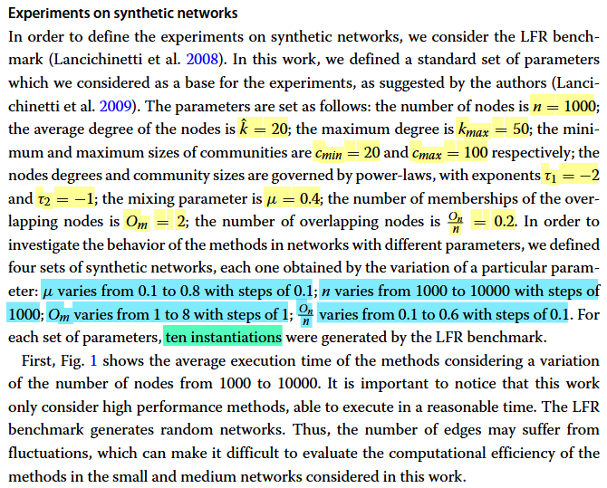
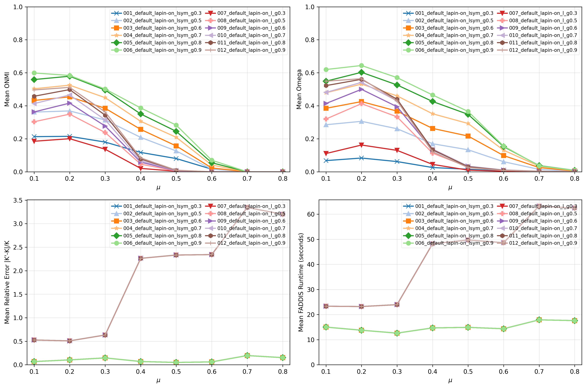
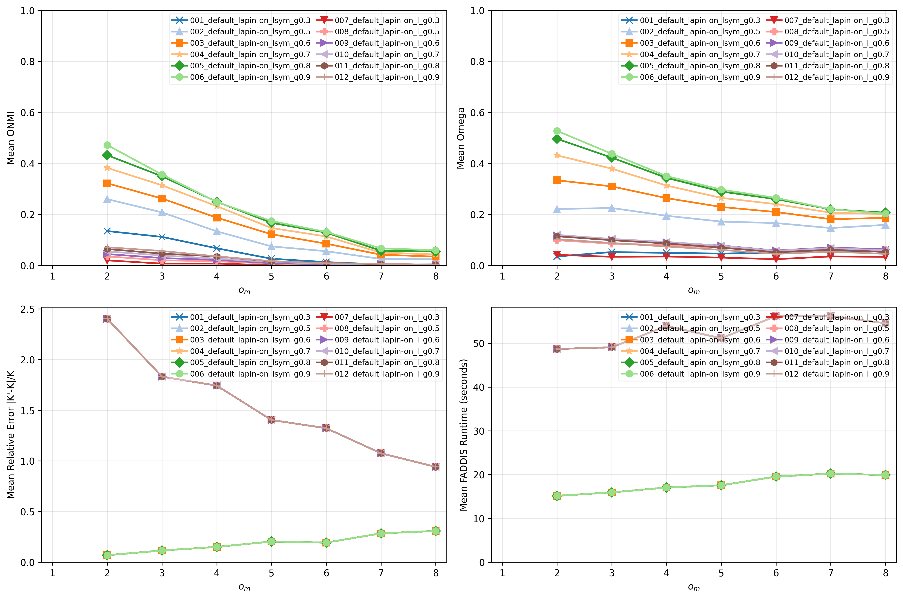
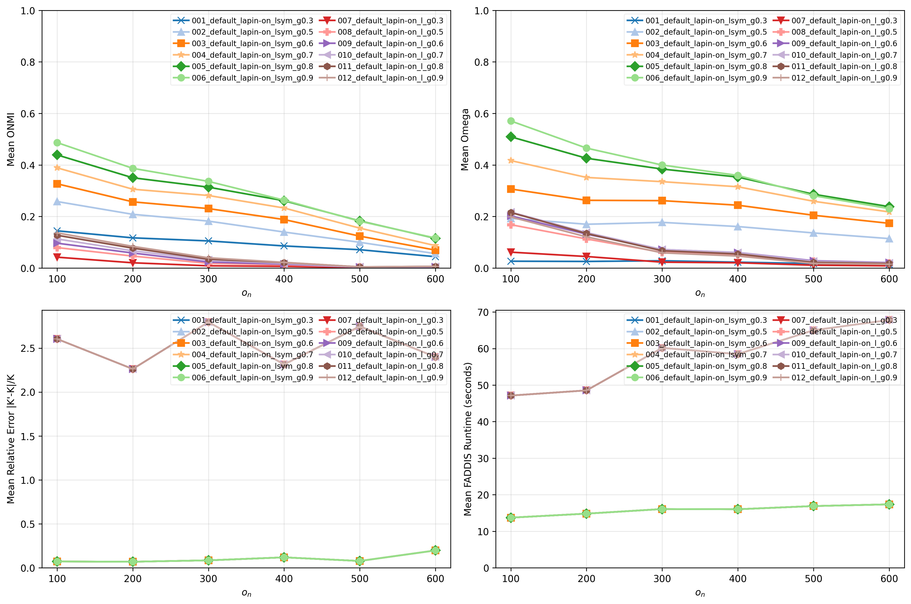

# Report 8 - Experiences with LAPIN and Laplacian variants

## Table of Contents

- [Setup](#setup)
- [Scripts](#scripts)
- [Thresholds](#thresholds)
    - [Experience 5 (LAPIN-off + Extraction of K desired clusters)](#experience-5-lapin-off--extraction-of-k-desired-clusters)
- [Boundary Variation Set](#boundary-variation-set)
    - [Experience 5 (LAPIN-off + Extraction of K desired clusters) Results](#experience-5-lapin-off--extraction-of-k-desired-clusters-results)
- [Membership Variation Set](#membership-variation-set)
    - [Experience 5 (LAPIN-off + Extraction of K desired clusters) Results](#experience-5-lapin-off--extraction-of-k-desired-clusters-results-1)
- [Overlap Variation Set](#overlap-variation-set)
    - [Experience 5 (LAPIN-off + Extraction of K desired clusters) Results](#experience-5-lapin-off--extraction-of-k-desired-clusters-results-2)
- [Size Variation Set](#size-variation-set)
    - [Experience 5 (LAPIN-off + Extraction of K desired clusters) Results](#experience-5-lapin-off--extraction-of-k-desired-clusters-results-3)
- [Hardware](#hardware)

## Setup

### Reference Networks

- Base parameters:
    - $\overline{d}$ = 20
    - $d_{max}$ = 50
    - $c_{min}$ = 20
    - $c_{max}$ = 100
    - $t1$ = -2
    - $t2$ = -1
    - $n$ = 1000
    - $\mu$ = 0.4
    - $o_{n}/n$ = 0.2
    - $o_{m}$ = 2
- Instances per set of parameters: 10
- Boundary Variation Set: $\mu$ $\in$ [0.1, 0.8], step 0.1
- Membership Variation Set: $o_{m}$ $\in$ [1, 8], step 1
- Overlap Variation Set: $o_{n}/n$ $\in$ [0.1, 0.6], step 0.1

### Networks

- Same base parameters as the reference setup
- Same instances per set of parameters as the reference setup
- Same Boundary Variation Set
- Same Membership Variation Set
- Same Overlap Variation Set

## Scripts

### Script 1

- For experience 5 (set of thresholds), apply the pipeline to each network of each variation set and save the results for each network in a .csv file:

1. `LFR synthetic network`
2. `Default (Adjacency matrix)`
3. `Sparsification not applied`
4. `LAPIN-on (Lsym) and LAPIN-on (L)`
5. `epsilon = threshold of the network family; tau = 0.05; k_max = min(500, n/2)`
6. `FADDIS with stop criterion (epsilon, tau, k_max)`
7. `gamma = [0.3, 0.5, 0.6, 0.7, 0.8, 0.9]`
8. `Extrinsic metrics = [Relative Error of K, ONMI, Omega]`

- For each experience (set of thresholds), draw two plots for each variation set showing the mean ONMI and Omega results by the tested variant, identical to the plots of the reference paper. Additionally, plot the relative error of K (number of communities) and the mean runtime of FADDIS.

## Thresholds

###  Experience 5 (LAPIN-off + Extraction of K desired clusters)

| Network Family    | Selected Metric | Threshold              |
|-------------------|-----------------|------------------------|
| 01_nL_uL_onnL_omL | Median          | 7.131570706178536e-05  |
| 02_nL_uL_onnL_omM | Median          | 6.452183162665591e-05  |
| 03_nL_uL_onnM_omL | Median          | 3.597517130544882e-05  |
| 04_nL_uL_onnM_omM | Median          | 1.8061869999003227e-05 |
| 05_nL_uM_onnL_omL | Median          | 1.7825136109080203e-05 |
| 06_nL_uM_onnL_omM | Median          | 1.4275401255574377e-05 |
| 07_nL_uM_onnM_omL | Median          | 7.19077150618138e-06   |
| 08_nL_uM_onnM_omM | Median          | 3.169941198295696e-06  |
| 09_nM_uL_onnL_omL | Median          | 4.884506224590443e-05  |
| 10_nM_uL_onnL_omM | Median          | 4.015680373336101e-05  |
| 11_nM_uL_onnM_omL | Median          | 1.9732615784769943e-05 |
| 12_nM_uL_onnM_omM | Median          | 7.844071757855867e-06  |
| 13_nM_uM_onnL_omL | Median          | 9.836007762161582e-06  |
| 14_nM_uM_onnL_omM | Median          | 6.934873453732481e-06  |
| 15_nM_uM_onnM_omL | Median          | 3.3096368147017807e-06 |
| 16_nM_uM_onnM_omM | Median          | 1.672976896664927e-06  |
| 39_nM_uM_onnL_omH | Median          | 5.638508927189958e-06  |
| 43_nM_uM_onnH_omL | Median          | 1.3655437454067635e-06 |
| 46_nM_uH_onnL_omL | Median          | 1.5705502911294985e-06 |

## Boundary Variation Set

### Experience 5 (LAPIN-off + Extraction of K desired clusters) Results

[Open Folder](../../results/synthetic/boundary_variation_set/lapin_and_laplacian/results_2026-06-17_16-17-14-278377/)

- **Observations**
    - "Best" laplacian: "Lsym"

## Membership Variation Set

### Experience 5 (LAPIN-off + Extraction of K desired clusters) Results

[Open Folder](../../results/synthetic/membership_variation_set/lapin_and_laplacian/results_2026-06-18_16-51-24-027093/)

- **Observations**
    - "Best" laplacian: "Lsym"

## Overlap Variation Set

### Experience 5 (LAPIN-off + Extraction of K desired clusters) Results

[Open Folder](../../results/synthetic/overlap_variation_set/lapin_and_laplacian/results_2026-06-19_21-09-49-051769/)

- **Observations**
    - "Best" laplacian: "Lsym"

## Hardware

