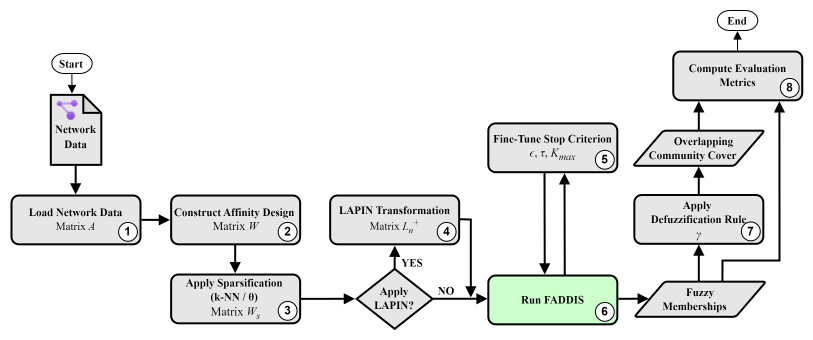

# Report 1 - Question: How do the fine-tuned thresholds behave in terms of extrinsic metrics (Relative Error of K, ONMI, Omega) in seen networks?

## Table of Contents
- [Scripts](#scripts)
- [Experiment 1 (LAPIN-off + Extraction of K desired clusters) - Thresholds](#experiment-1-lapin-off--extraction-of-k-desired-clusters---thresholds)
- [Experiment 2 (LAPIN-off + Extraction of clusters until the end) - Thresholds](#experiment-2-lapin-off--extraction-of-clusters-until-the-end---thresholds)
- [Experiment 3 (LAPIN-on + Extraction of K desired clusters) - Thresholds](#experiment-3-lapin-on--extraction-of-k-desired-clusters---thresholds)
- [Experiment 4 (LAPIN-on + Extraction of clusters until the end) - Thresholds](#experiment-4-lapin-on--extraction-of-clusters-until-the-end---thresholds)

## Scripts

### Script 2

- Apply the pipeline to 1/4 of the seen LFR networks per family (72/4 = 18 networks) and save the results for each network in a .csv file:

1. `LFR synthetic network`
2. `Default (Adjacency matrix)`
3. `Sparsification not applied`
4. `LAPIN-off and LAPIN-on`
5. `epsilon = threshold of the network family; tau = 0.05; k_max = min(100, n/2)`
6. `FADDIS with stop criterion (epsilon, tau, k_max)`
7. `gamma = [0.3, 0.5, 0.7]; conditional discard of first cluster = [True, False]`
8. `Extrinsic metrics = [Relative Error of K, ONMI, Omega]`

- Draw three line plots for each network, showing the extrinsic results (Relative Error of K, ONMI, Omega) by the tested variant.
- Draw three line plots for each network family, showing the mean extrinsic results (Relative Error of K, ONMI, Omega) by the tested variant.
- Draw three global line plots, showing all mean extrinsic results (Relative Error of K, ONMI, Omega) by the tested variant.

##  Experience 1 (LAPIN-off + Extraction of K desired clusters) - Thresholds

### Thresholds

| Network Family    | Selected Metric | Threshold |
|-------------------|-----------------|-----------|
| 01_nL_uL_onnL_omL | Median          | 7.7e-05   |
| 02_nL_uL_onnL_omM | Median          | 7e-05     |
| 03_nL_uL_onnM_omL | Median          | 3.9e-05   |
| 04_nL_uL_onnM_omM | Median          | 2e-05     |
| 05_nL_uM_onnL_omL | Median          | 1.9e-05   |
| 06_nL_uM_onnL_omM | Median          | 1.6e-05   |
| 07_nL_uM_onnM_omL | Median          | 8e-06     |
| 08_nL_uM_onnM_omM | Median          | 3e-06     |
| 09_nM_uL_onnL_omL | Median          | 5.3e-05   |
| 10_nM_uL_onnL_omM | Median          | 4.4e-05   |
| 11_nM_uL_onnM_omL | Median          | 2.1e-05   |
| 12_nM_uL_onnM_omM | Median          | 8e-06     |
| 13_nM_uM_onnL_omL | Median          | 1.1e-05   |
| 14_nM_uM_onnL_omM | Median          | 8e-06     |
| 15_nM_uM_onnM_omL | Median          | 4e-06     |
| 16_nM_uM_onnM_omM | Median          | 2e-06     |

### Extrinsic Results

[Open Folder](../results/synthetic/1_4_seen_networks/experience1_cluster/results_2026-04-04_18-01-39-080614)

## Experience 2 (LAPIN-off + Extraction of clusters until the end) - Thresholds

### Thresholds

| Network Family    | Selected Metric | Threshold |
|-------------------|-----------------|-----------|
| 01_nL_uL_onnL_omL | Median          | 5.8e-05   |
| 02_nL_uL_onnL_omM | Median          | 6e-05     |
| 03_nL_uL_onnM_omL | Median          | 2.9e-05   |
| 04_nL_uL_onnM_omM | Median          | 1.5e-05   |
| 05_nL_uM_onnL_omL | Median          | 6e-06     |
| 06_nL_uM_onnL_omM | Median          | 8e-06     |
| 07_nL_uM_onnM_omL | Median          | 3e-06     |
| 08_nL_uM_onnM_omM | Median          | 2e-06     |
| 09_nM_uL_onnL_omL | Median          | 4.4e-05   |
| 10_nM_uL_onnL_omM | Median          | 3.5e-05   |
| 11_nM_uL_onnM_omL | Median          | 1.6e-05   |
| 12_nM_uL_onnM_omM | Median          | 8e-06     |
| 13_nM_uM_onnL_omL | Median          | 6e-06     |
| 14_nM_uM_onnL_omM | Median          | 5e-06     |
| 15_nM_uM_onnM_omL | Median          | 3e-06     |
| 16_nM_uM_onnM_omM | Median          | 1e-06     |

### Extrinsic Results

[Open Folder](../results/synthetic/1_4_seen_networks/experience2_cluster/results_2026-04-05_09-07-19-011166)

## Experience 3 (LAPIN-on + Extraction of K desired clusters) - Thresholds

### Thresholds

| Network Family    | Selected Metric | Threshold |
|-------------------|-----------------|-----------|
| 01_nL_uL_onnL_omL | Median          | 8.9e-05   |
| 02_nL_uL_onnL_omM | Median          | 8.1e-05   |
| 03_nL_uL_onnM_omL | Median          | 4.2e-05   |
| 04_nL_uL_onnM_omM | Median          | 3.1e-05   |
| 05_nL_uM_onnL_omL | Median          | 2e-05     |
| 06_nL_uM_onnL_omM | Median          | 1.3e-05   |
| 07_nL_uM_onnM_omL | Median          | 1.1e-05   |
| 08_nL_uM_onnM_omM | Median          | 5e-06     |
| 09_nM_uL_onnL_omL | Median          | 4.3e-05   |
| 10_nM_uL_onnL_omM | Median          | 4.1e-05   |
| 11_nM_uL_onnM_omL | Median          | 1.7e-05   |
| 12_nM_uL_onnM_omM | Median          | 1.4e-05   |
| 13_nM_uM_onnL_omL | Median          | 7e-06     |
| 14_nM_uM_onnL_omM | Median          | 4e-06     |
| 15_nM_uM_onnM_omL | Median          | 3e-06     |
| 16_nM_uM_onnM_omM | Median          | 2e-06     |

### Extrinsic Results

[Open Folder](../results/synthetic/1_4_seen_networks/experience3_cluster/results_2026-04-06_22-28-25-819274)

## Experience 4 (LAPIN-on + Extraction of clusters until the end) - Thresholds

### Thresholds

| Network Family    | Selected Metric | Threshold |
|-------------------|-----------------|-----------|
| 01_nL_uL_onnL_omL | Median          | 1.6e-05   |
| 02_nL_uL_onnL_omM | Median          | 4.5e-05   |
| 03_nL_uL_onnM_omL | Median          | 1.7e-05   |
| 04_nL_uL_onnM_omM | Median          | 2.4e-05   |
| 05_nL_uM_onnL_omL | Median          | 2e-06     |
| 06_nL_uM_onnL_omM | Median          | 2e-06     |
| 07_nL_uM_onnM_omL | Median          | 2e-06     |
| 08_nL_uM_onnM_omM | Median          | 2e-06     |
| 09_nM_uL_onnL_omL | Median          | 2.1e-05   |
| 10_nM_uL_onnL_omM | Median          | 2.4e-05   |
| 11_nM_uL_onnM_omL | Median          | 1e-05     |
| 12_nM_uL_onnM_omM | Median          | 1.3e-05   |
| 13_nM_uM_onnL_omL | Median          | 2e-06     |
| 14_nM_uM_onnL_omM | Median          | 2e-06     |
| 15_nM_uM_onnM_omL | Median          | 2e-06     |
| 16_nM_uM_onnM_omM | Median          | 2e-06     |

### Extrinsic Results

[Open Folder](../results/synthetic/1_4_seen_networks/experience4_cluster/results_2026-04-07_07-18-02-169177)
