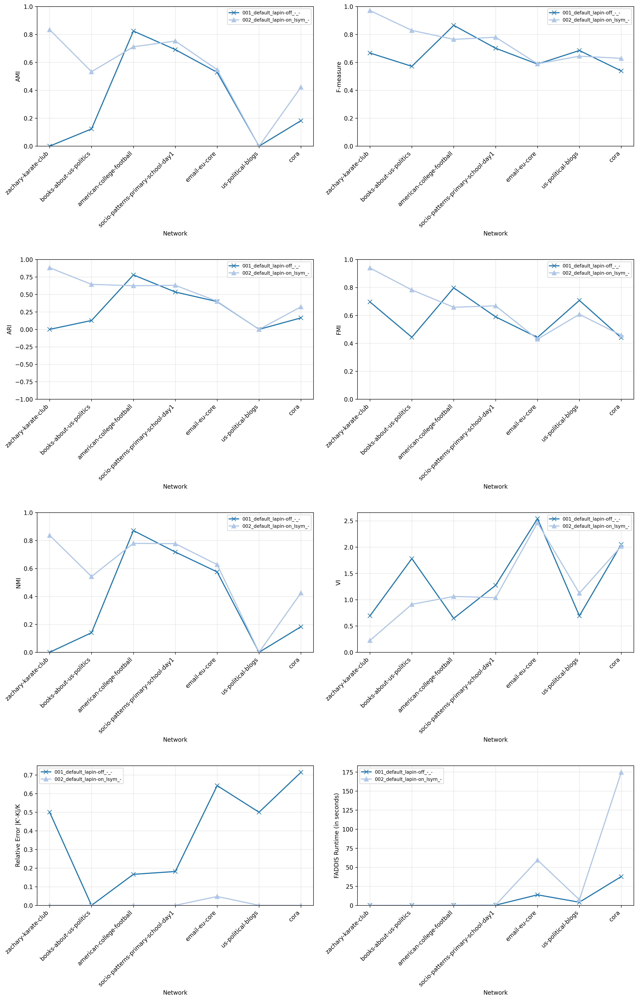
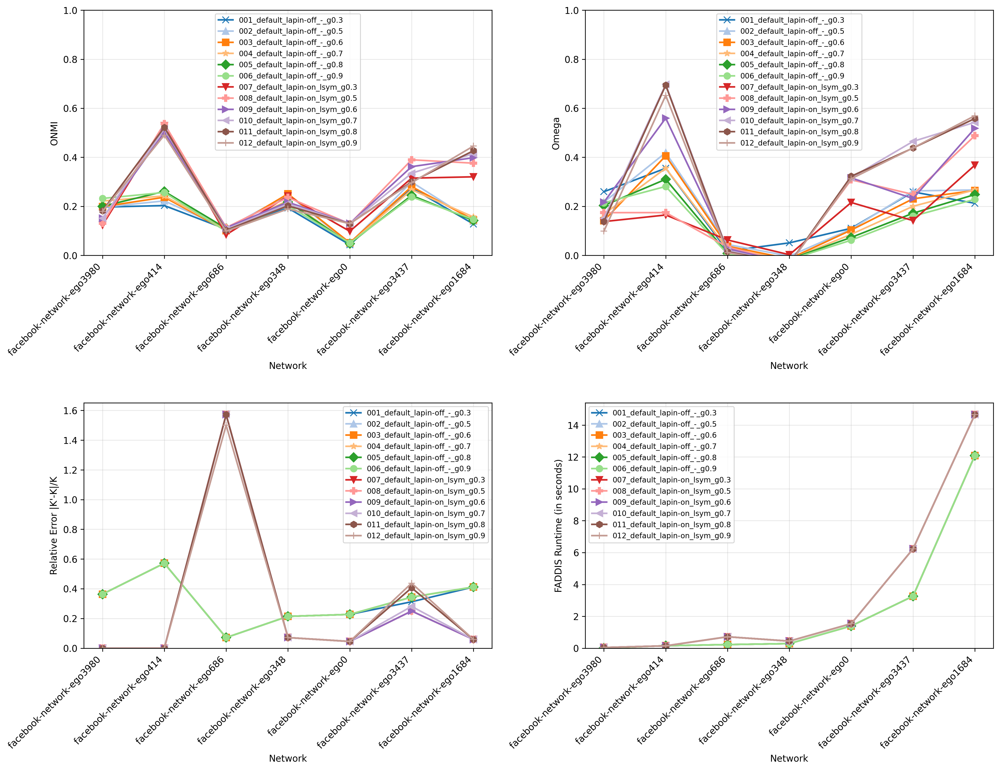
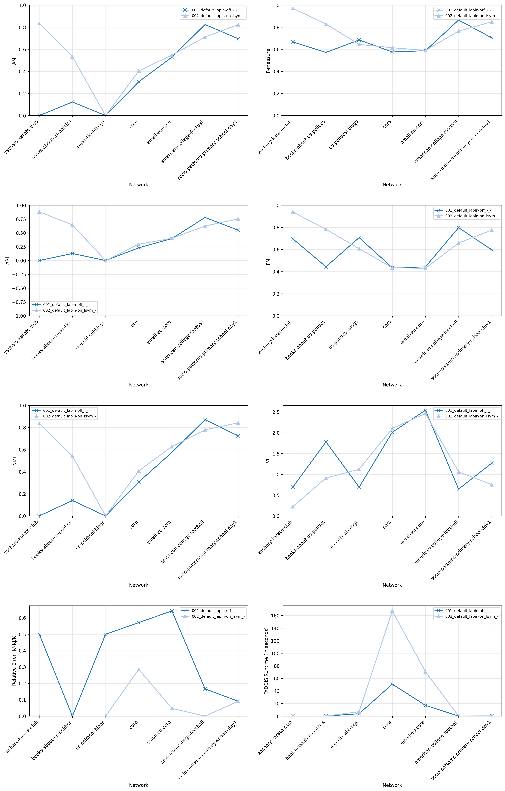
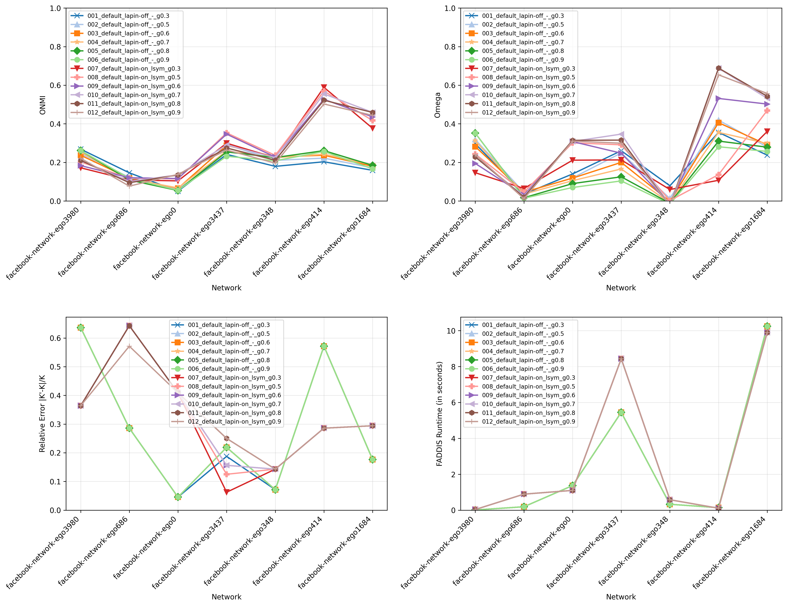
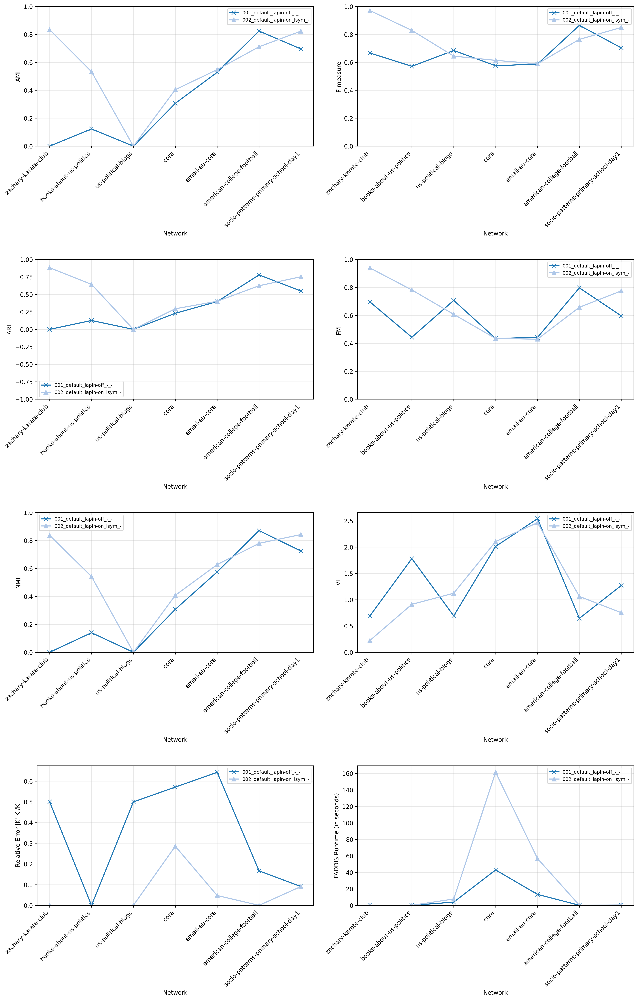
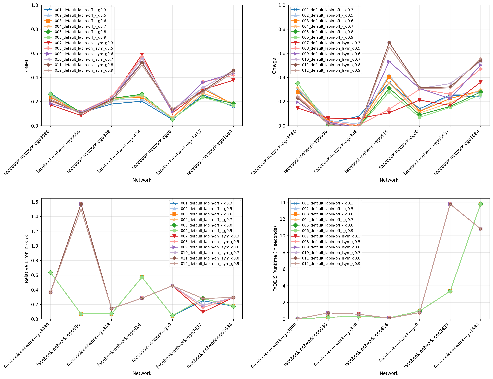

# Report 10 - Experiments on real-world networks (Part III)

## Table of Contents

- [Experience 9 (One network per family - Train Set)](#experience-9-one-network-per-family---train-set)
- [Experience 10 (Networks grouped by degree assortativity and average degree - Train Set)](#experience-10-networks-grouped-by-degree-assortativity-and-average-degree---train-set)
- [Experience 11 (Networks grouped by degree assortativity, average degree, and K - Train Set)](#experience-11-networks-grouped-by-degree-assortativity-average-degree-and-k---train-set)
- [Discussion](#discussion)

## Experience 9 (One network per family - Train Set)

### LAPIN-on Median K Boundary Raw Contributions

[Open Folder](../results/real-world/experience9/results_2026-05-21_18-52-42-258845/)

## Experience 10 (Networks grouped by degree assortativity and average degree - Train Set)

### LAPIN-on Median K Boundary Raw Contributions

[Open Folder](../results/real-world/experience10/results_2026-05-21_19-07-49-017976/)

## Experience 11 (Networks grouped by degree assortativity, average degree, and K - Train Set)

### LAPIN-on Median K Boundary Raw Contributions

[Open Folder](../results/real-world/experience11/results_2026-05-21_19-50-50-467475/)

## Discussion

- **Observations**
    - TODO  

- **Warnings**
    - TODO  

- **TODO**
    - TODO
