# Report 10 - Experiments on real-world networks (Part III)

## Table of Contents

- [Experience 9 (One network per family - Train Set)](#experience-9-one-network-per-family---train-set)
- [Experience 10 - Train Set (Networks grouped by degree assortativity, average degree, and K)](#experience-10---train-set-networks-grouped-by-degree-assortativity-average-degree-and-k)
- [Experience 10 - Test Set (Networks grouped by degree assortativity, average degree, and K)](#experience-10---test-set-networks-grouped-by-degree-assortativity-average-degree-and-k)
- [Experience 11 - Train Set (Networks grouped by degree assortativity, average degree)](#experience-11---train-set-networks-grouped-by-degree-assortativity-average-degree)
- [Experience 11 - Test Set (Networks grouped by degree assortativity, average degree)](#experience-11---test-set-networks-grouped-by-degree-assortativity-average-degree)
- [Discussion](#discussion)

## Experience 9 (One network per family - Train Set)

### LAPIN-on Median K Boundary Raw Contributions

[Open Folder](../results/real-world/experience9/results_2026-05-23_18-31-35-504770/)

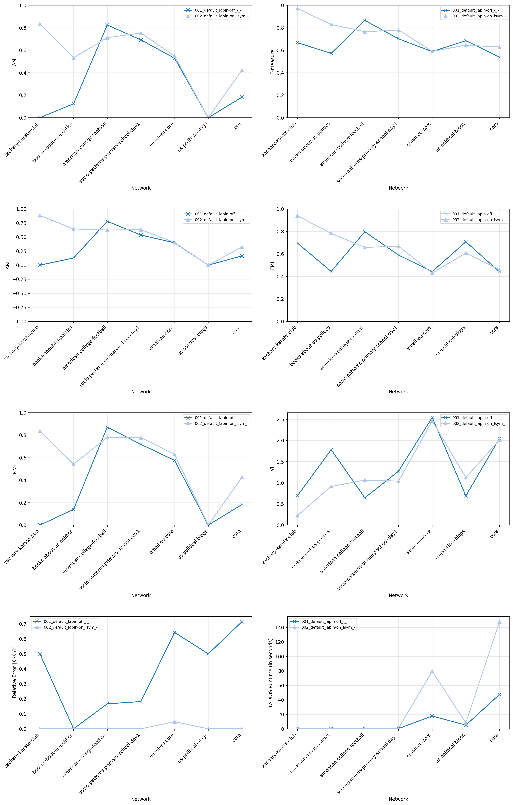

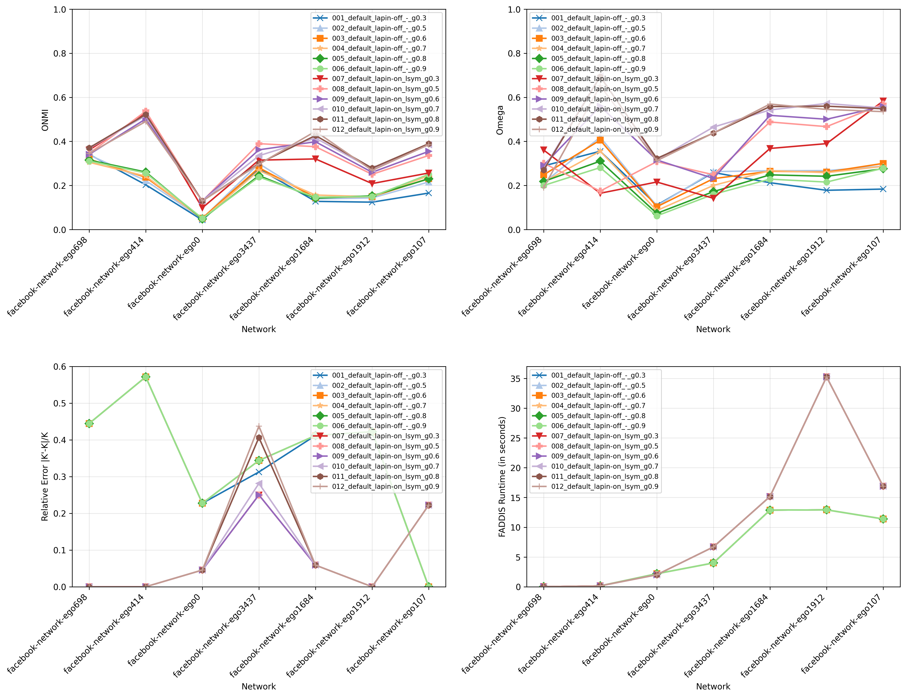

## Experience 10 - Train Set (Networks grouped by degree assortativity, average degree, and K)

### LAPIN-on Median K Boundary Raw Contributions

[Open Folder](../results/real-world/experience10_train_set/results_2026-05-23_18-48-04-504201/)

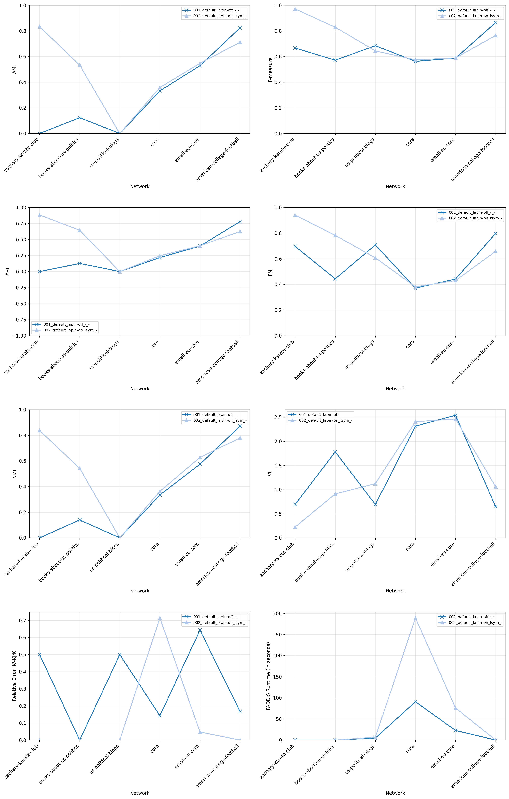

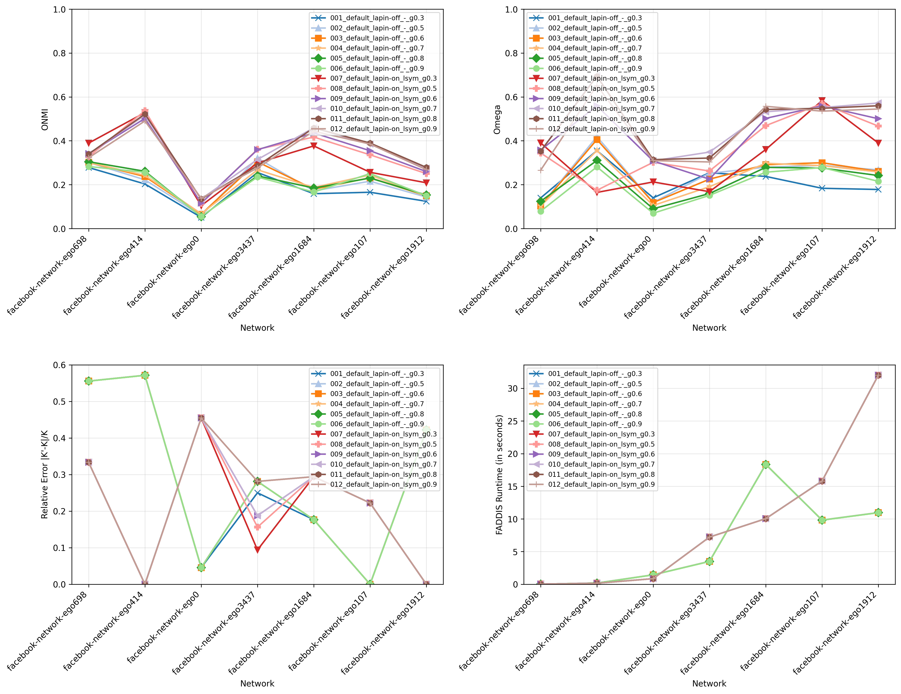

## Experience 10 - Test Set (Networks grouped by degree assortativity, average degree, and K)

### LAPIN-on Median K Boundary Raw Contributions

[Open Folder](../results/real-world/experience10_test_set/results_2026-05-23_19-34-21-746608/)

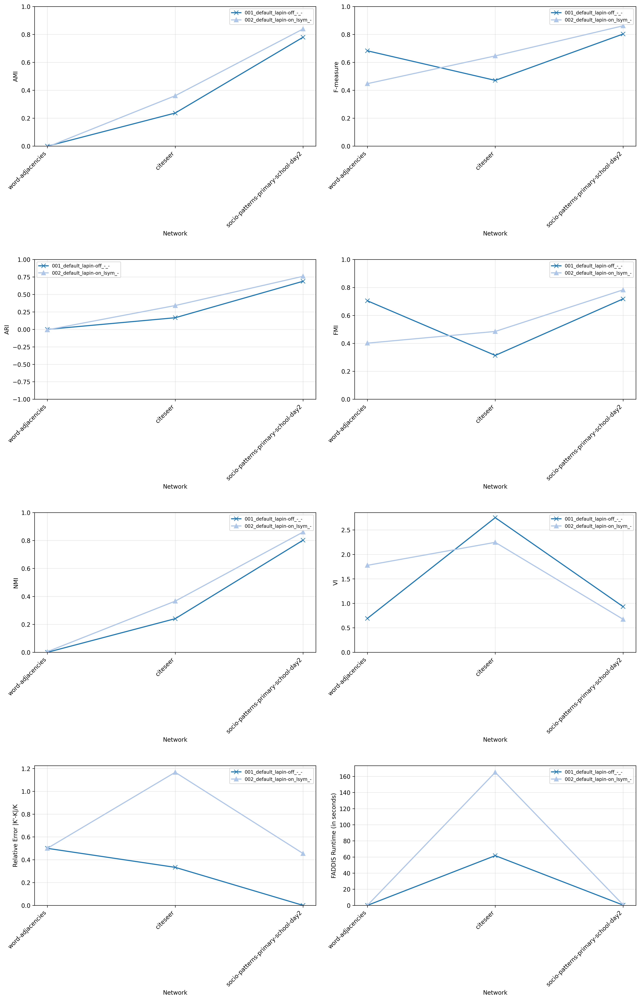

## Experience 11 - Train Set (Networks grouped by degree assortativity, average degree)

### LAPIN-on Median K Boundary Raw Contributions

[Open Folder](../results/real-world/experience11_train_set/results_2026-05-23_19-07-59-472648/)

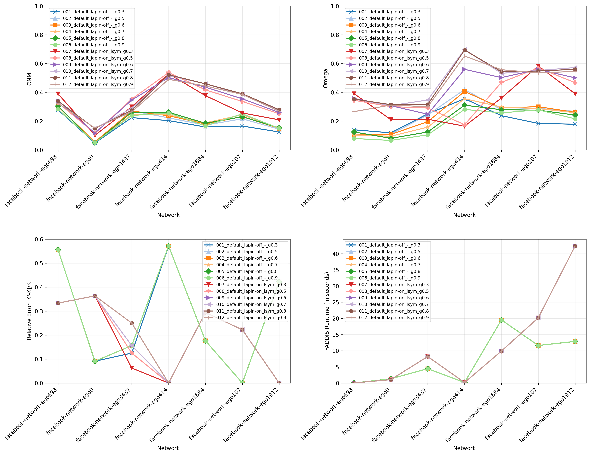

## Experience 11 - Test Set (Networks grouped by degree assortativity, average degree)

### LAPIN-on Median K Boundary Raw Contributions

[Open Folder](../results/real-world/experience11_test_set/results_2026-05-23_19-46-22-129301/)

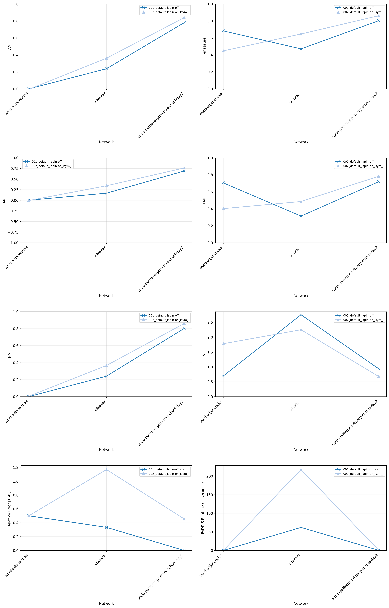

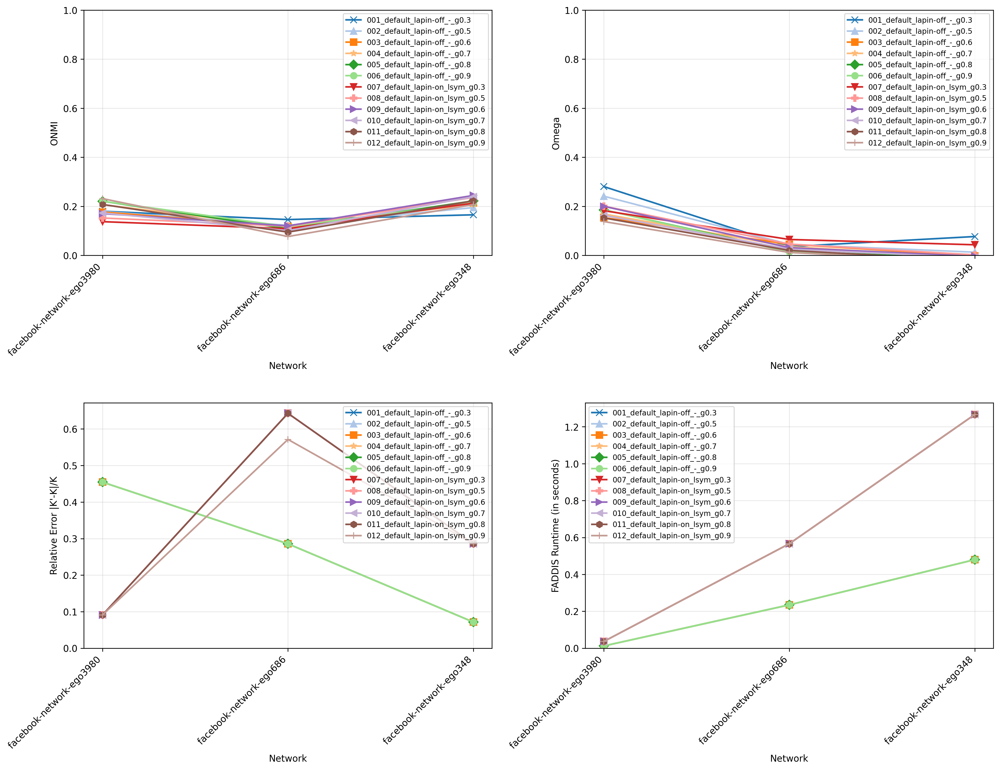

## Experience 12 - Train Set (Networks grouped by ground-truth type, degree assortativity, and average degree)

### LAPIN-on Median K Boundary Raw Contributions

[Open Folder](../results/real-world/experience12_train_set/results_2026-05-24_00-16-39-860352/)

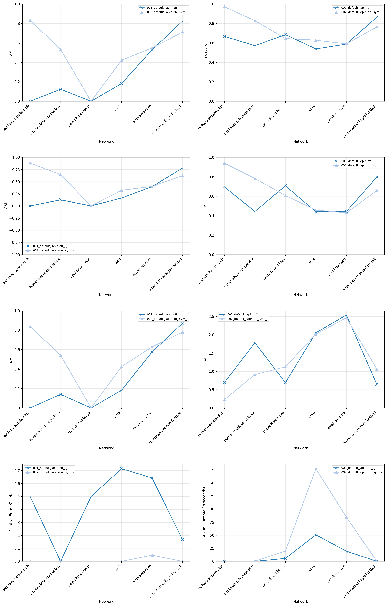

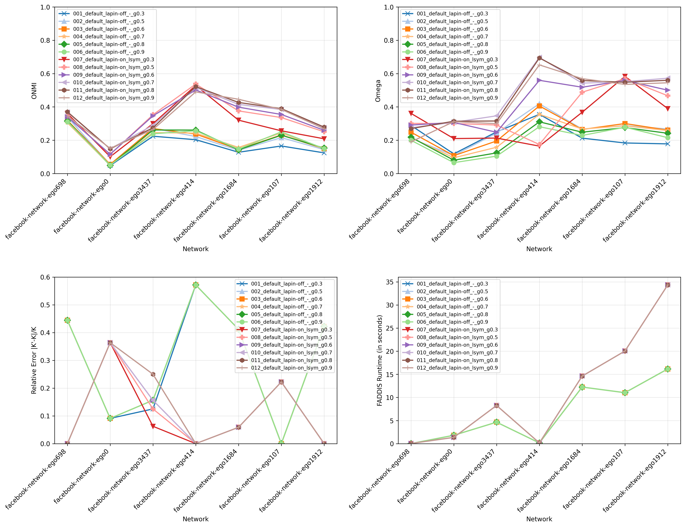

## Experience 12 - Test Set (Networks grouped by ground-truth type, degree assortativity, and average degree)

### LAPIN-on Median K Boundary Raw Contributions

[Open Folder](../results/real-world/experience12_test_set/results_2026-05-24_00-48-15-846586/)

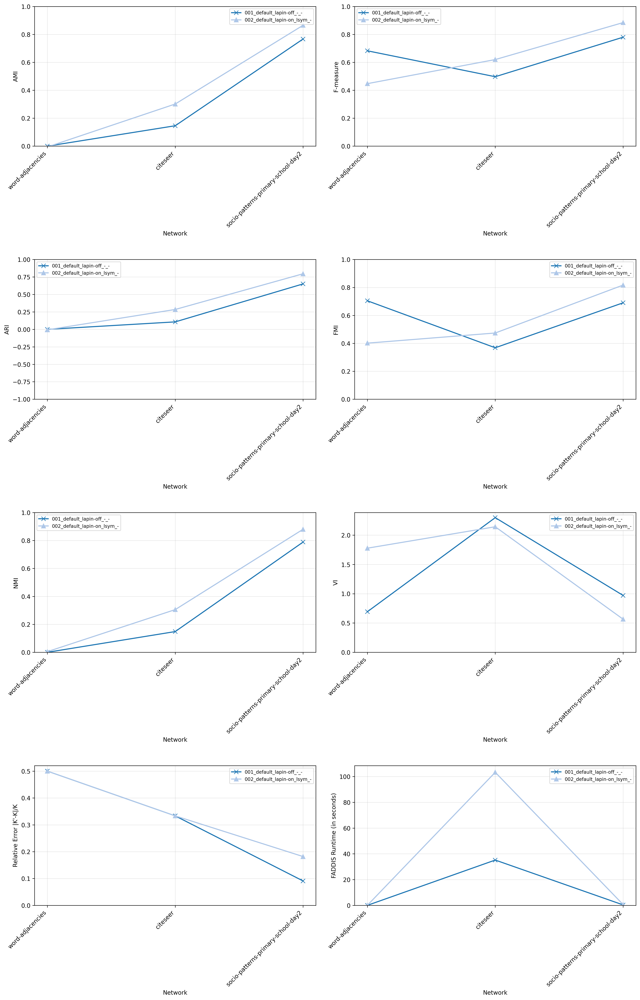

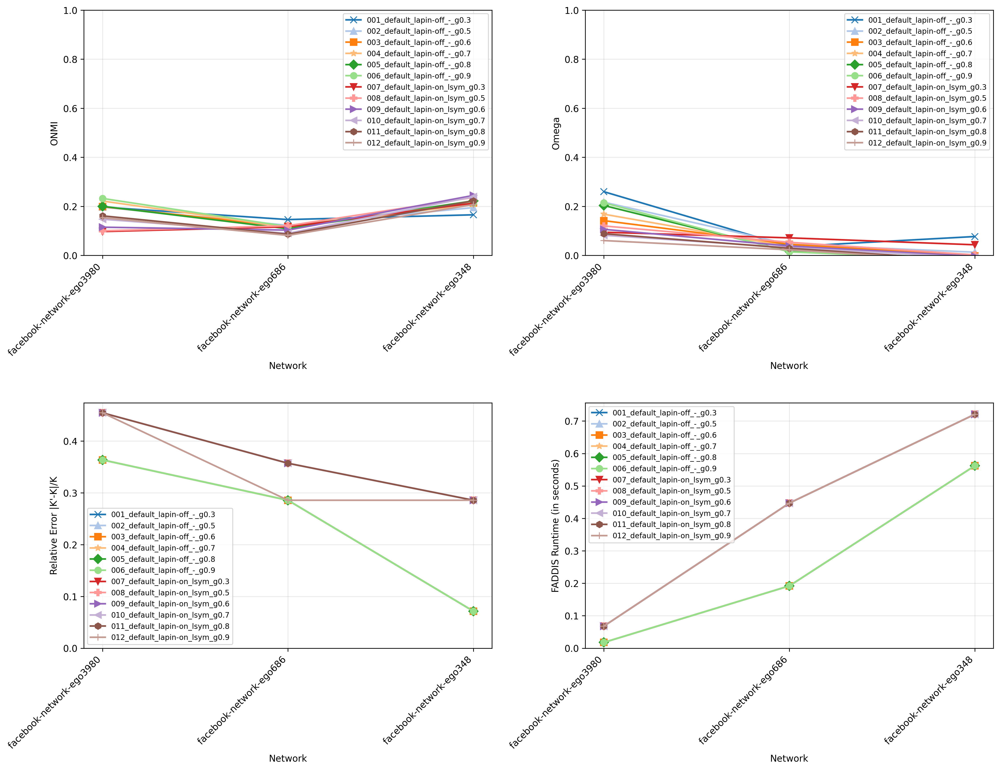

## Discussion

- **Observations**
    - TODO  

- **Warnings**
    - TODO  

- **TODO**
    - TODO
