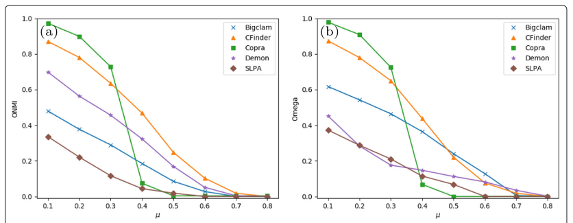
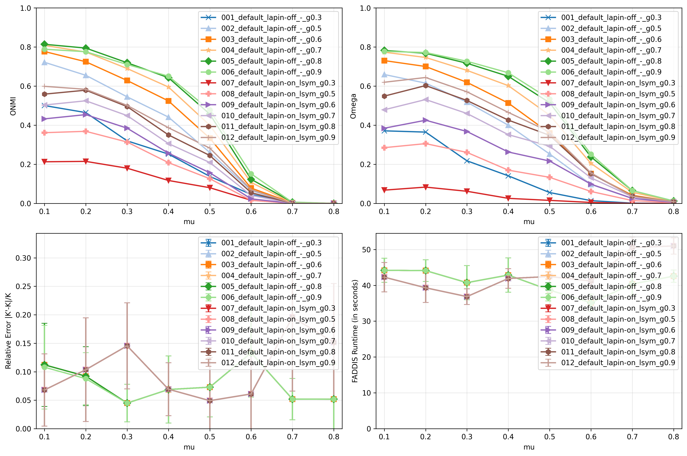
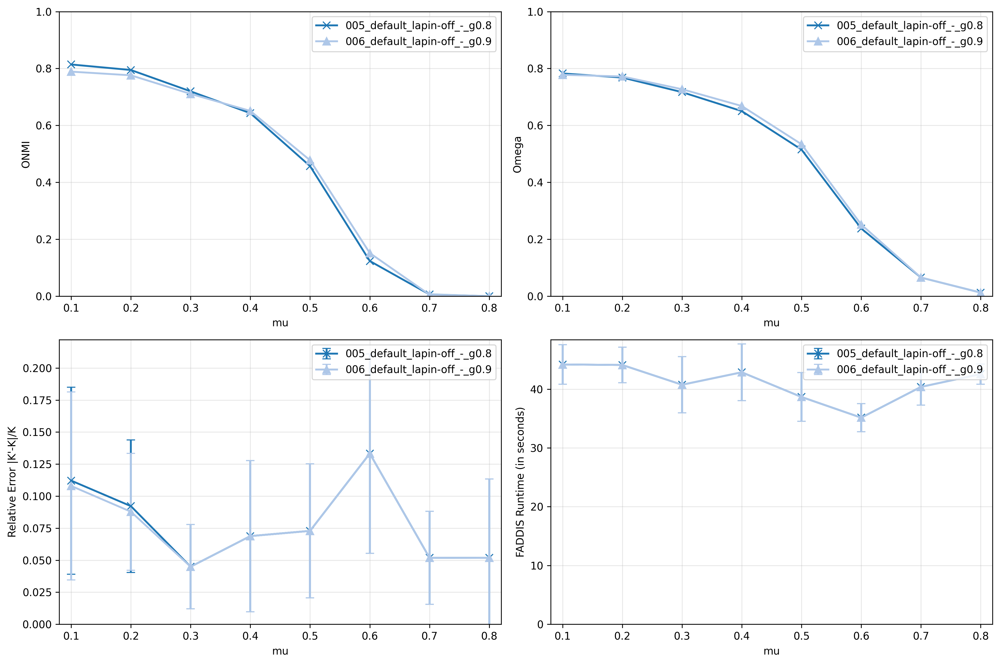
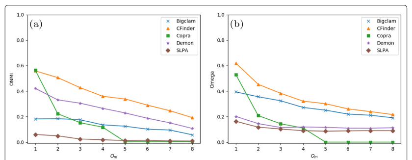
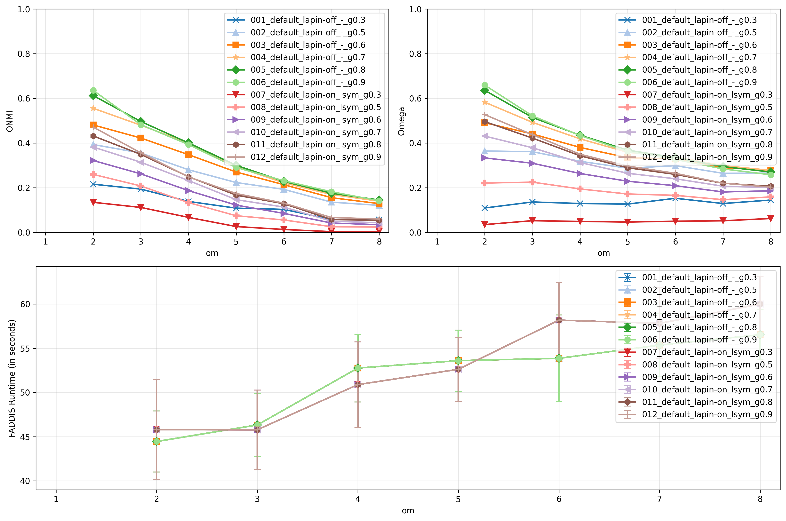
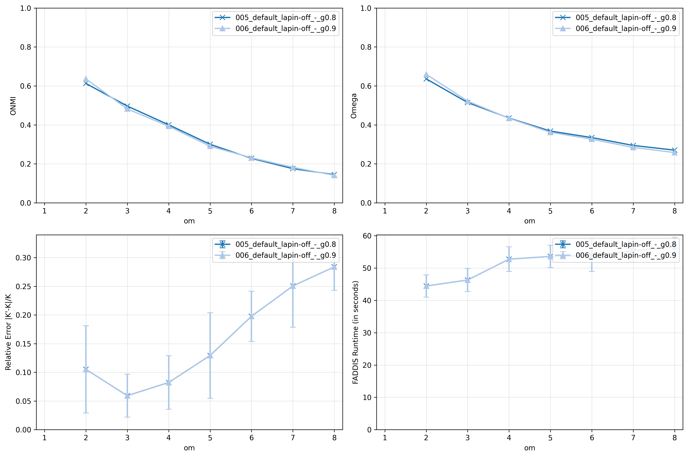
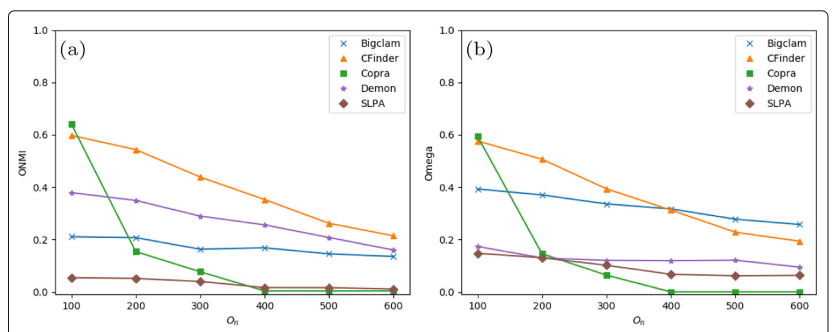
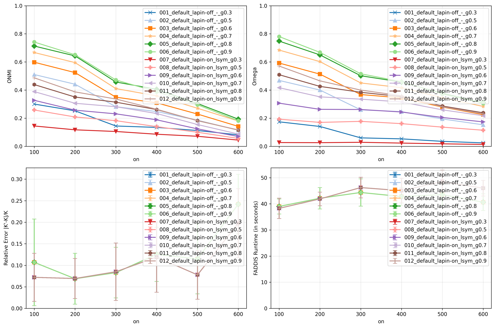
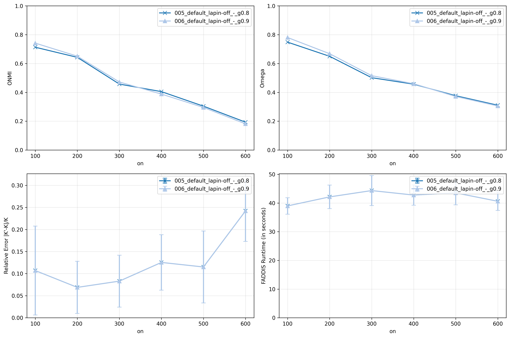

# Report 3 - Question (Phase II): Using the fine-tuned thresholds, can we obtain competitive results compared to the reference paper Vieira et al. Applied Network Science (2020) with large parameter values?

## Table of Contents

- [Setup](#setup)
- [Scripts](#scripts)
- [Thresholds](#thresholds)
    - [Experience 5 (LAPIN-off + Extraction of K desired clusters)](#experience-5-lapin-off--extraction-of-k-desired-clusters)
    - [Experience 6 (LAPIN-off + Extraction of clusters until the end)](#experience-6-lapin-off--extraction-of-clusters-until-the-end)
    - [Experience 7 (LAPIN-on + Extraction of K desired clusters)](#experience-7-lapin-on--extraction-of-k-desired-clusters)
    - [Experience 8 (LAPIN-on + Extraction of clusters until the end)](#experience-8-lapin-on--extraction-of-clusters-until-the-end)
- [Boundary Variation Set](#boundary-variation-set)
    - [Reference Results](#reference-results)
    - [Experience 5 (Baseline) (LAPIN-off + Extraction of K desired clusters) Results](#experience-5-baseline-lapin-off--extraction-of-k-desired-clusters-results)
- [Membership Variation Set](#membership-variation-set)
    - [Reference Results](#reference-results-1)
    - [Experience 5 (Baseline) (LAPIN-off + Extraction of K desired clusters) Results](#experience-5-baseline-lapin-off--extraction-of-k-desired-clusters-results-1)
- [Overlap Variation Set](#overlap-variation-set)
    - [Reference Results](#reference-results-2)
    - [Experience 5 (Baseline) (LAPIN-off + Extraction of K desired clusters) Results](#experience-5-baseline-lapin-off--extraction-of-k-desired-clusters-results-2)
- [Hardware](#hardware)
- [References](#references)

## Setup

### Reference Networks

- Base parameters:
    - $\overline{d}$ = 20
    - $d_{max}$ = 50
    - $c_{min}$ = 20
    - $c_{max}$ = 100
    - $t1$ = -2
    - $t2$ = -1
    - $n$ = 1000
    - $\mu$ = 0.4
    - $o_{n}/n$ = 0.2
    - $o_{m}$ = 2
- Instances per set of parameters: 10
- Boundary Variation Set: $\mu$ $\in$ [0.1, 0.8], step 0.1
- Membership Variation Set: $o_{m}$ $\in$ [1, 8], step 1
- Overlap Variation Set: $o_{n}/n$ $\in$ [0.1, 0.6], step 0.1
- Size Variation Set: $n$ $\in$ [1000, 10000], step 1000

### Networks

- Same base parameters as the reference setup
- Same instances per set of parameters as the reference setup
- Same Boundary Variation Set
- Same Membership Variation Set
- Same Overlap Variation Set
- Without Size Variation Set

## Scripts

### Script 1

- For each experience (set of thresholds), apply the pipeline to each network of each variation set and save the results for each network in a .csv file:

1. `LFR synthetic network`
2. `Default (Adjacency matrix)`
3. `Sparsification not applied`
4. `LAPIN-off and LAPIN-on`
5. `epsilon = threshold of the network family; tau = 0.05; k_max = min(100, n/2)`
6. `FADDIS with stop criterion (epsilon, tau, k_max)`
7. `gamma = [0.3, 0.5, 0.6, 0.7, 0.8, 0.9]`
8. `Extrinsic metrics = [Relative Error of K, ONMI, Omega]`

- For each experience (set of thresholds), draw two plots for each variation set showing the mean ONMI and Omega results by the tested variant, identical to the plots of the reference paper. Additionally, plot the relative error of K (number of communities) and the mean runtime of FADDIS.

## Thresholds

###  Experience 5 (LAPIN-off + Extraction of K desired clusters)

| Network Family    | Selected Metric | Threshold              |
|-------------------|-----------------|------------------------|
| 01_nL_uL_onnL_omL | Median          | 7.131570706178536e-05  |
| 02_nL_uL_onnL_omM | Median          | 6.452183162665591e-05  |
| 03_nL_uL_onnM_omL | Median          | 3.597517130544882e-05  |
| 04_nL_uL_onnM_omM | Median          | 1.8061869999003227e-05 |
| 05_nL_uM_onnL_omL | Median          | 1.7825136109080203e-05 |
| 06_nL_uM_onnL_omM | Median          | 1.4275401255574377e-05 |
| 07_nL_uM_onnM_omL | Median          | 7.19077150618138e-06   |
| 08_nL_uM_onnM_omM | Median          | 3.169941198295696e-06  |
| 09_nM_uL_onnL_omL | Median          | 4.884506224590443e-05  |
| 10_nM_uL_onnL_omM | Median          | 4.015680373336101e-05  |
| 11_nM_uL_onnM_omL | Median          | 1.9732615784769943e-05 |
| 12_nM_uL_onnM_omM | Median          | 7.844071757855867e-06  |
| 13_nM_uM_onnL_omL | Median          | 9.836007762161582e-06  |
| 14_nM_uM_onnL_omM | Median          | 6.934873453732481e-06  |
| 15_nM_uM_onnM_omL | Median          | 3.3096368147017807e-06 |
| 16_nM_uM_onnM_omM | Median          | 1.672976896664927e-06  |
| 39_nM_uM_onnL_omH | Median          | 5.638508927189958e-06  |
| 43_nM_uM_onnH_omL | Median          | 1.3655437454067635e-06 |
| 46_nM_uH_onnL_omL | Median          | 1.5705502911294985e-06 |

###  Experience 6 (LAPIN-off + Extraction of clusters until the end)

| Network Family    | Selected Metric | Threshold              |
|-------------------|-----------------|------------------------|
| 01_nL_uL_onnL_omL | Median          | 5.3353016777232356e-05 |
| 02_nL_uL_onnL_omM | Median          | 5.527270873336184e-05  |
| 03_nL_uL_onnM_omL | Median          | 2.690490304442535e-05  |
| 04_nL_uL_onnM_omM | Median          | 1.3983497043349274e-05 |
| 05_nL_uM_onnL_omL | Median          | 5.8928286105116595e-06 |
| 06_nL_uM_onnL_omM | Median          | 7.332702993754699e-06  |
| 07_nL_uM_onnM_omL | Median          | 2.7991218366511875e-06 |
| 08_nL_uM_onnM_omM | Median          | 2.10701450455141e-06   |
| 09_nM_uL_onnL_omL | Median          | 4.033213398067446e-05  |
| 10_nM_uL_onnL_omM | Median          | 3.196001074894147e-05  |
| 11_nM_uL_onnM_omL | Median          | 1.4625381004154202e-05 |
| 12_nM_uL_onnM_omM | Median          | 6.976670015680567e-06  |
| 13_nM_uM_onnL_omL | Median          | 5.688900607855931e-06  |
| 14_nM_uM_onnL_omM | Median          | 4.939332202483173e-06  |
| 15_nM_uM_onnM_omL | Median          | 2.518244987918179e-06  |
| 16_nM_uM_onnM_omM | Median          | 1.376378534048229e-06  |
| 39_nM_uM_onnL_omH | Median          | 4.8468375111567665e-06 |
| 43_nM_uM_onnH_omL | Median          | 1.1942623005433341e-06 |
| 46_nM_uH_onnL_omL | Median          | 4.912281783543144e-07  |

###  Experience 7 (LAPIN-on + Extraction of K desired clusters)

| Network Family    | Selected Metric | Threshold              |
|-------------------|-----------------|------------------------|
| 01_nL_uL_onnL_omL | Median          | 8.54072591150887e-05   |
| 02_nL_uL_onnL_omM | Median          | 7.783638353177548e-05  |
| 03_nL_uL_onnM_omL | Median          | 3.992705481071253e-05  |
| 04_nL_uL_onnM_omM | Median          | 2.964651050231931e-05  |
| 05_nL_uM_onnL_omL | Median          | 1.880780206186746e-05  |
| 06_nL_uM_onnL_omM | Median          | 1.2569171467468851e-05 |
| 07_nL_uM_onnM_omL | Median          | 1.031100658696153e-05  |
| 08_nL_uM_onnM_omM | Median          | 4.448279379989367e-06  |
| 09_nM_uL_onnL_omL | Median          | 4.1007015206001445e-05 |
| 10_nM_uL_onnL_omM | Median          | 3.87299688230591e-05   |
| 11_nM_uL_onnM_omL | Median          | 1.6618869423213632e-05 |
| 12_nM_uL_onnM_omM | Median          | 1.3186705265267445e-05 |
| 13_nM_uM_onnL_omL | Median          | 6.906092966372945e-06  |
| 14_nM_uM_onnL_omM | Median          | 4.279168882073914e-06  |
| 15_nM_uM_onnM_omL | Median          | 3.300124021751621e-06  |
| 16_nM_uM_onnM_omM | Median          | 1.6481801384039982e-06 |
| 39_nM_uM_onnL_omH | Median          | 3.4437125125331185e-06 |
| 43_nM_uM_onnH_omL | Median          | 1.5681039929237823e-06 |
| 46_nM_uH_onnL_omL | Median          | 2.771063765186848e-06  |

### Experience 8 (LAPIN-on + Extraction of clusters until the end)

| Network Family    | Selected Metric | Threshold              |
|-------------------|-----------------|------------------------|
| 01_nL_uL_onnL_omL | Median          | 1.4709309158741336e-05 |
| 02_nL_uL_onnL_omM | Median          | 4.31681230914532e-05   |
| 03_nL_uL_onnM_omL | Median          | 1.6602807554414064e-05 |
| 04_nL_uL_onnM_omM | Median          | 2.329059920286411e-05  |
| 05_nL_uM_onnL_omL | Median          | 2.148188332926315e-06  |
| 06_nL_uM_onnL_omM | Median          | 2.252070158372644e-06  |
| 07_nL_uM_onnM_omL | Median          | 1.6805572285539315e-06 |
| 08_nL_uM_onnM_omM | Median          | 2.1605073908487925e-06 |
| 09_nM_uL_onnL_omL | Median          | 2.025730812729182e-05  |
| 10_nM_uL_onnL_omM | Median          | 2.285632463928619e-05  |
| 11_nM_uL_onnM_omL | Median          | 9.222547654010063e-06  |
| 12_nM_uL_onnM_omM | Median          | 1.1976657667071576e-05 |
| 13_nM_uM_onnL_omL | Median          | 2.0513948237377787e-06 |
| 14_nM_uM_onnL_omM | Median          | 2.207547290125855e-06  |
| 15_nM_uM_onnM_omL | Median          | 1.4807924756032774e-06 |
| 16_nM_uM_onnM_omM | Median          | 1.5371305372157242e-06 |
| 39_nM_uM_onnL_omH | Median          | 2.6718167104796284e-06 |
| 43_nM_uM_onnH_omL | Median          | 1.0565510582107734e-06 |
| 46_nM_uH_onnL_omL | Median          | 6.224030661783513e-07  |

## Boundary Variation Set

### Reference Results

### Experience 5 (Baseline) (LAPIN-off + Extraction of K desired clusters) Results

[Open Folder](../results/synthetic/boundary_variation_set/experience5_cluster_0/results_2026-04-19_12-06-10-999135/)

- **Observations**
    - "Best" variants
        - 005_default_lapin-off_-_g0.8
        - 006_default_lapin-off_-_g0.9
    - Stop Condition
        - epsilon or W
    - FADDIS Runtime:
        - Best variants:
            - Best time: +/-35s ($\mu$=0.6)
            - Worst time: +/-44s ($\mu$=0.1)
    - $\mu$ = 0.1
        - [ONMI] Copra
        - [Omega] Copra
    - $\mu$ = 0.2
        - [ONMI] Copra
        - [Omega] Copra
    - $\mu$ = 0.3 
        - [ONMI] **FADDIS**/Copra
        - [Omega] **FADDIS**/Copra
    - $\mu$ = 0.4 
        - [ONMI] **FADDIS**
        - [Omega] **FADDIS**
    - $\mu$ = 0.5
        - [ONMI] **FADDIS**
        - [Omega] **FADDIS**
    - $\mu$ = 0.6 
        - [ONMI] **FADDIS**/CFinder
        - [Omega] **FADDIS**
    - $\mu$ = 0.7
        - [ONMI] -
        - [Omega] **FADDIS**
    - $\mu$ = 0.8
        - [ONMI] -
        - [Omega] -

## Membership Variation Set

### Reference Results

### Experience 5 (Baseline) (LAPIN-off + Extraction of K desired clusters) Results

[Open Folder](../results/synthetic/membership_variation_set/experience5_cluster_0/results_2026-04-19_18-21-44-389254/)

- **Observations**
    - "Best" variants
        - 005_default_lapin-off_-_g0.8
        - 006_default_lapin-off_-_g0.9
    - Stop Condition
        - epsilon or W
    - FADDIS Runtime:
        - Best variants:
            - Best time: +/-44s ($\mu$=2)
            - Worst time: +/-56s ($\mu$=8)
    - $o_{m}$ = 2
        - [ONMI] **FADDIS**
        - [Omega] **FADDIS**
    - $o_{m}$ = 3
        - [ONMI] **FADDIS**
        - [Omega] **FADDIS**
    - $o_{m}$ = 4
        - [ONMI] **FADDIS**/CFinder
        - [Omega] **FADDIS**
    - $o_{m}$ = 5 
        - [ONMI] CFinder
        - [Omega] **FADDIS**
    - $o_{m}$ = 6
        - [ONMI] CFinder
        - [Omega] **FADDIS**
    - $o_{m}$ = 7
        - [ONMI] CFinder
        - [Omega] **FADDIS**
    - $o_{m}$ = 8
        - [ONMI] CFinder
        - [Omega] **FADDIS**

## Overlap Variation Set

### Reference Results

### Experience 5 (Baseline) (LAPIN-off + Extraction of K desired clusters) Results

[Open Folder](../results/synthetic/overlap_variation_set/experience5_cluster_0/results_2026-04-19_22-29-26-629180/)

- **Observations**
    - "Best" variants
        - 005_default_lapin-off_-_g0.8
        - 006_default_lapin-off_-_g0.9
    - Stop Condition
        - epsilon or W
    - FADDIS Runtime:
        - Best variants:
            - Best time: +/-39s ($o_{n}/n$=0.1)
            - Worst time: +/-44s ($o_{n}/n$=0.3)
    - $o_{n}/n$ = 0.1
        - [ONMI] **FADDIS**
        - [Omega]  **FADDIS**
    - $o_{n}/n$ = 0.2
        - [ONMI] **FADDIS**
        - [Omega] **FADDIS**
    - $o_{n}/n$ = 0.3
        - [ONMI] **FADDIS**
        - [Omega] **FADDIS**
    - $o_{n}/n$ = 0.4 
        - [ONMI] **FADDIS**/CFinder
        - [Omega] **FADDIS**
    - $o_{n}/n$ = 0.5
        - [ONMI] **FADDIS**
        - [Omega] **FADDIS**/Bigclam
    - $o_{n}/n$ = 0.6
        - [ONMI] CFinder
        - [Omega] **FADDIS**/Bigclam

## Hardware

## References

[1] V. da Fonseca Vieira, C. R. Xavier, and A. G. Evsukoff. “A comparative study of
overlapping community detection methods from the perspective of the structural
properties”. In: Applied Network Science 5 (2020), p. 51. doi: 10.1007/s41109-020-
00289-9.