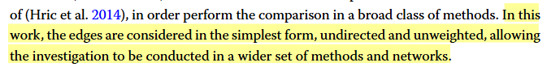
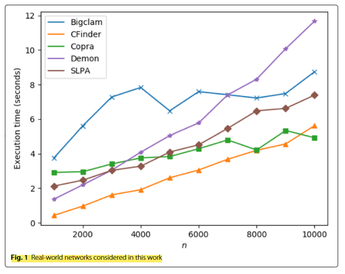
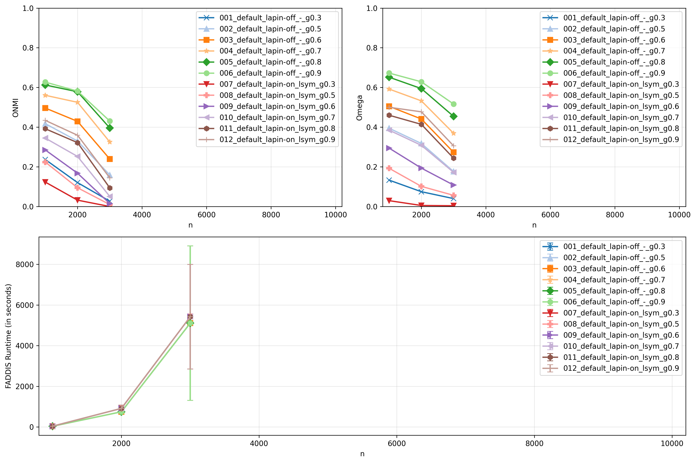
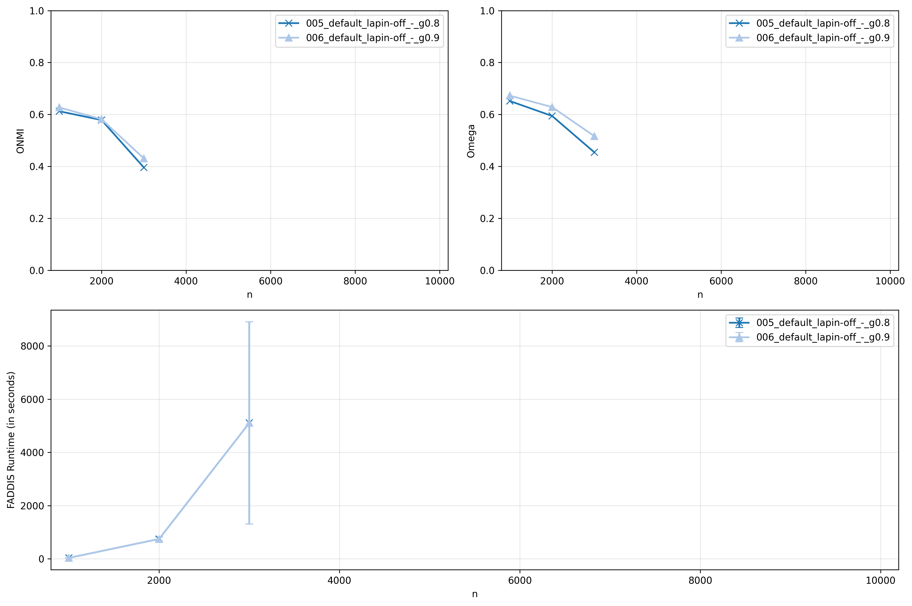
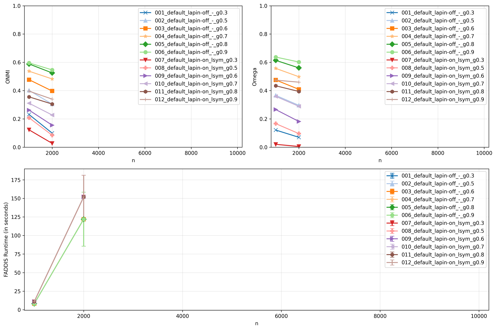
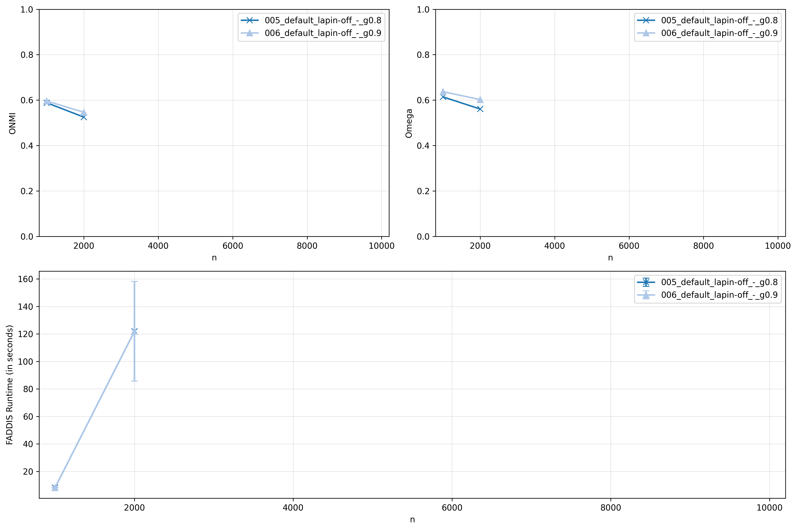
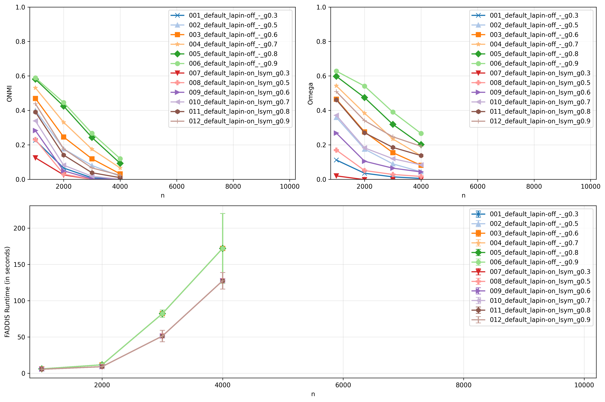
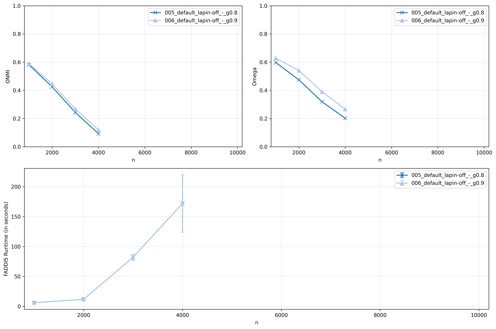
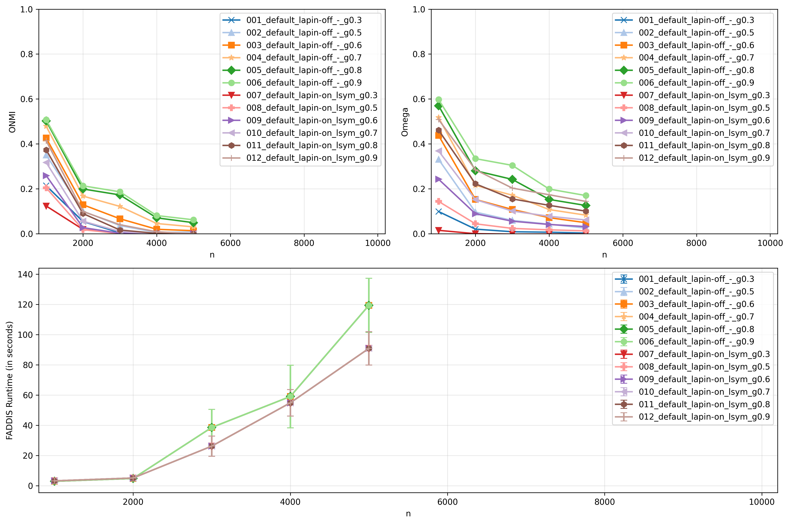
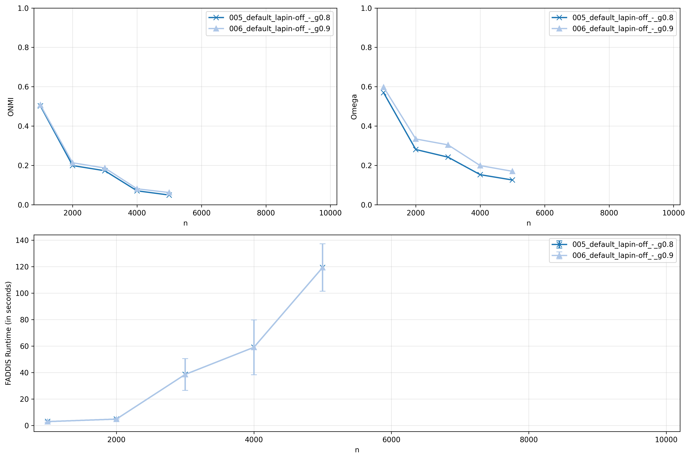

# Report 4 - Question (Part III): Can we obtain competitive results compared to the reference paper Vieira et al. Applied Network Science (2020) in large-scale networks?

## Table of Contents
- [Setup](#setup)
    - [Reference Networks](#reference-networks)
    - [Networks](#networks)
- [Scripts](#scripts)
    - [Script 2](#script-2)
- [Overlap Variation Set](#overlap-variation-set)
    - [Reference Results](#reference-results-2)
    - [Experience 6](#experience-6)
- [References](#references)


## Setup

### Reference Networks




- Base parameters:
    - $\overline{d}$ = 20
    - $d_{max}$ = 50
    - $c_{min}$ = 20
    - $c_{max}$ = 100
    - $t1$ = -2
    - $t2$ = -1
    - $n$ = 1000
    - $\mu$ = 0.4
    - $o_{n}/n$ = 0.2
    - $o_{m}$ = 2
- Instances per set of parameters: 10
- Boundary Variation Set: $\mu$ $\in$ [0.1, 0.8], step 0.1
- Membership Variation Set: $o_{m}$ $\in$ [1, 8], step 1
- Overlap Variation Set: $o_{n}/n$ $\in$ [0.1, 0.6], step 0.1
- Size Variation Set: $n$ $\in$ [1000, 10000], step 1000


### Networks

- Same base parameters as the reference setup
- Instances per set of parameters: **3**
- Same Variation Set


## Scripts

### Script 2

- For each experience (set of thresholds), apply the pipeline to each network of each variation set and save the results for each network in a .csv file:


1. `LFR synthetic network`
2. `Default (Adjacency matrix)`
3. `Sparsification not applied`
4. `LAPIN-off and LAPIN-on`
5. `desired_k = K + 1 if LAPIN-off else K`
6. `FADDIS with stop criterion (desired_k)`
7. `gamma = [0.3, 0.5, 0.6, 0.7, 0.8, 0.9]`
8. `Extrinsic metrics = [Relative Error of K, ONMI, Omega]`

- For each experience (set of thresholds), draw two plots for each variation set showing the mean ONMI and Omega results by the tested variant, identical to the plots of the reference paper. Additionally, plot the mean runtime of FADDIS.


## Size Variation Set

### Reference Results





### Experience with FADDIS version-a (GOT)

```python
sequence_of_matrices = []
curr_eigenvalues, curr_eigenvectors = LA.eig(Wt)
```

[Open Folder](../results/synthetic/size_variation_set/faddis_version_a_got/results_2026-04-20_08-40-19-143228/)






### Experience with FADDIS version-a (Improved)

```python
# sequence_of_matrices = []
curr_eigenvalues, curr_eigenvectors = LA.eigh(Wt)
```

[Open Folder](../results/synthetic/size_variation_set/faddis_version_a_improved/results_2026-04-26_12-11-17-239250/)






### Experience with FADDIS version-a top-10

```python
# sequence_of_matrices = []
curr_eigenvalues, curr_eigenvectors = eigsh(np.asarray(Wt), k=10, which="LA")
```

[Open Folder](../results/synthetic/size_variation_set/faddis_version_a_top_10/results_2026-04-26_08-24-20-677914/)






### Experience with FADDIS version-m

```python
# sequence_of_matrices = []
curr_eigenvalues, curr_eigenvectors = eigsh(np.asarray(Wt), k=1, which="LA")
```


[Open Folder](../results/synthetic/size_variation_set/faddis_version_m/results_2026-04-26_00-05-03-708303/)






## References

[1] V. da Fonseca Vieira, C. R. Xavier, and A. G. Evsukoff. “A comparative study of
overlapping community detection methods from the perspective of the structural
properties”. In: Applied Network Science 5 (2020), p. 51. doi: 10.1007/s41109-020-
00289-9.