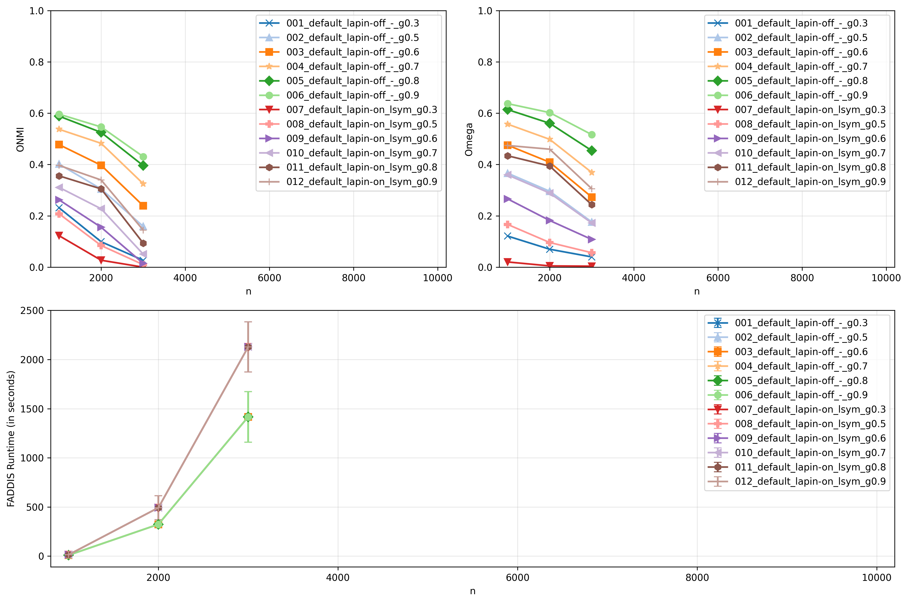
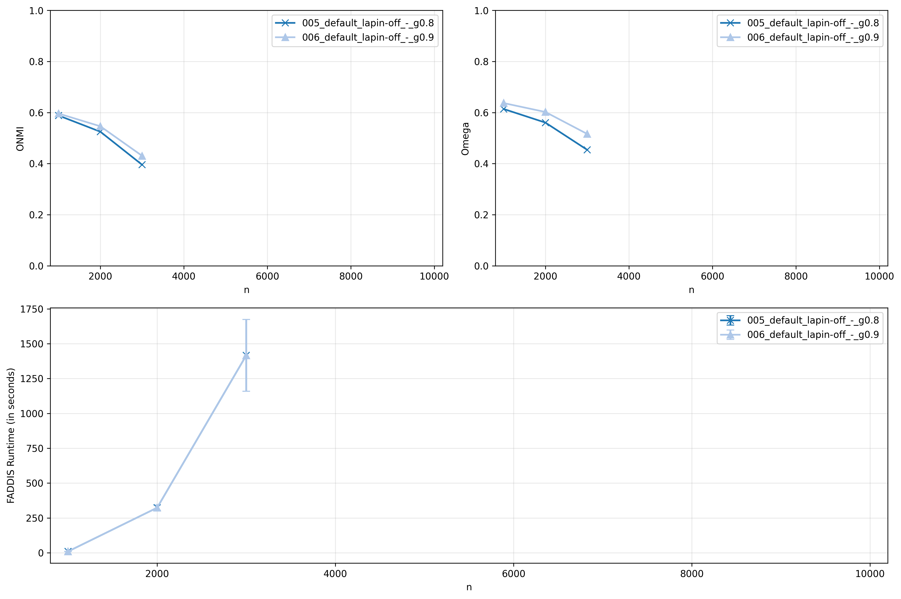
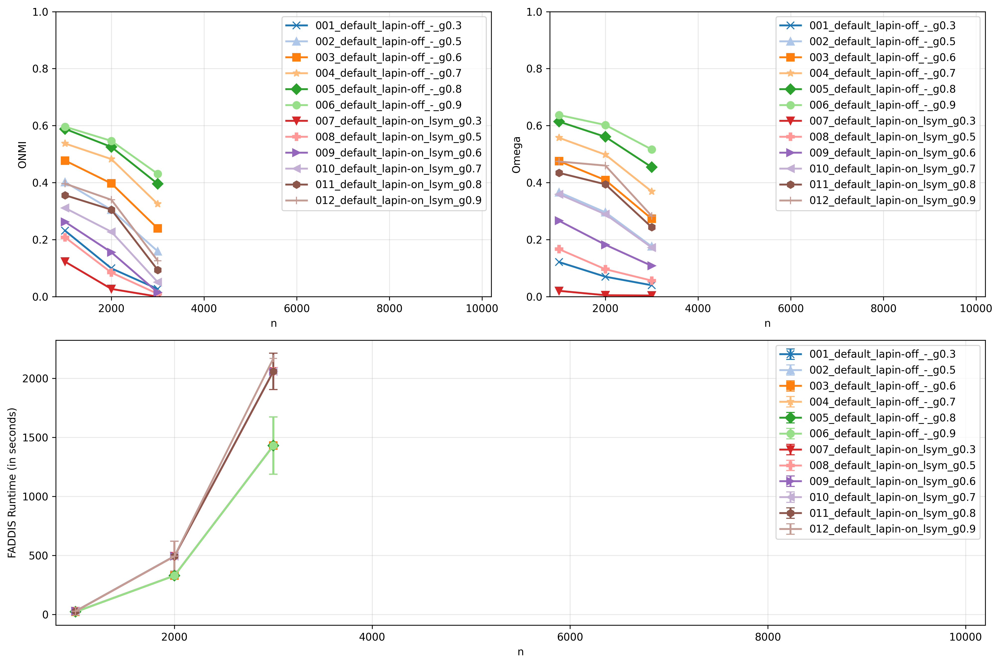
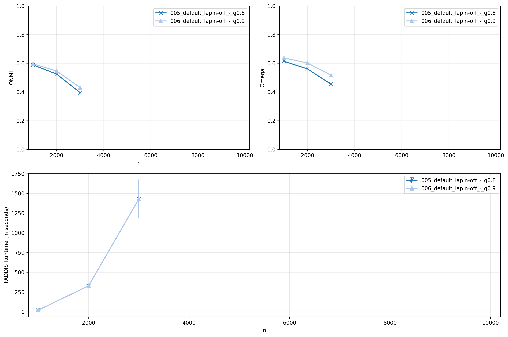
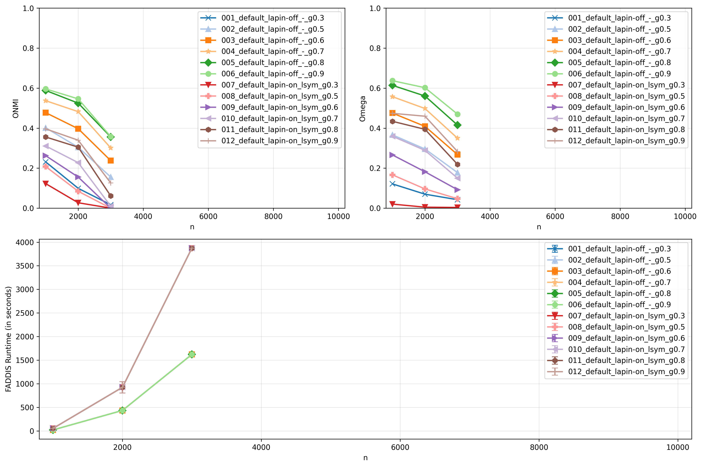
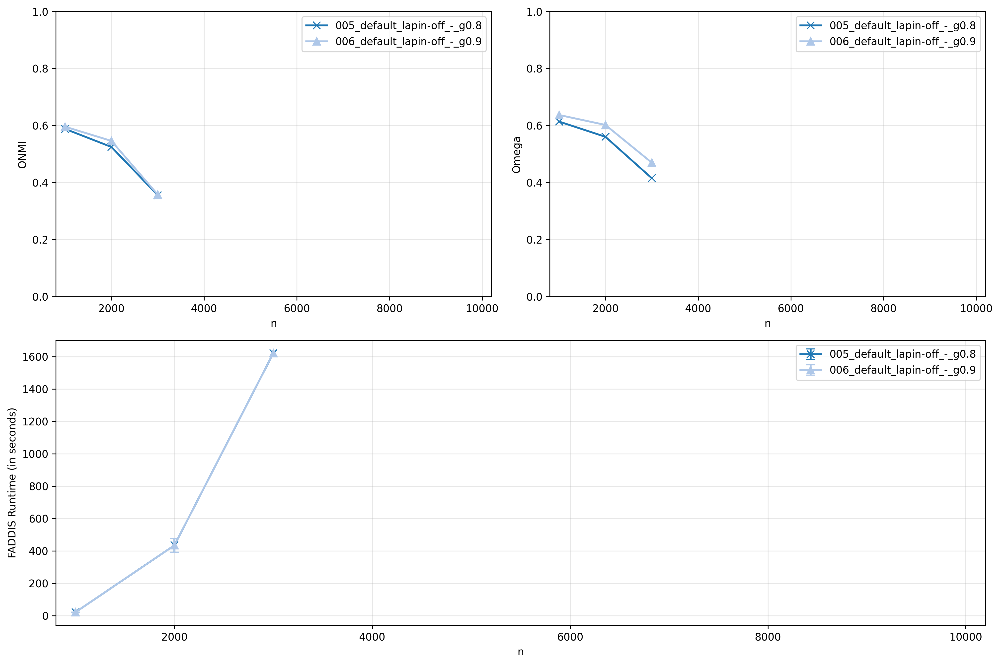

# Report 4 - Preliminary experiments of eigendecompositions implementations on large-networks


## Table of Contents

- [Setup](#setup)
- [Scripts](#scripts)
- [Size Variation Set](#size-variation-set)
  - [Reference Results](#reference-results)
  - [FADDIS Implementation Optimizations](#faddis-implementation-optimizations)
  - [Experience with numpy.linalg.eigh](#experience-with-numpylinalgeigh)
  - [Experience with scipy.linalg.eigh (driver='evd')](#experience-with-scipylinalgeigh-driverevd)
  - [Experience with scipy.linalg.eigh (driver='evr')](#experience-with-scipylinalgeigh-driverevr)
- [Hardware](#hardware)
- [References](#references)


## Setup

### Reference Networks


- Base parameters:
    - $\overline{d}$ = 20
    - $d_{max}$ = 50
    - $c_{min}$ = 20
    - $c_{max}$ = 100
    - $t1$ = -2
    - $t2$ = -1
    - $n$ = 1000
    - $\mu$ = 0.4
    - $o_{n}/n$ = 0.2
    - $o_{m}$ = 2
- Instances per set of parameters: 10
- Size Variation Set: $n$ $\in$ [1000, 10000], step 1000


### Networks

- Same base parameters as the reference setup
- Instances per set of parameters: **2** and **3**
- Same Variation Set


## Scripts

### Script 1

- For each experience (set of thresholds), apply the pipeline to each network of each variation set and save the results for each network in a .csv file:


1. `LFR synthetic network`
2. `Default (Adjacency matrix)`
3. `Sparsification not applied`
4. `LAPIN-off and LAPIN-on`
5. `desired_k = K + 1 if LAPIN-off else K`
6. `FADDIS with stop criterion (desired_k)`
7. `gamma = [0.3, 0.5, 0.6, 0.7, 0.8, 0.9]`
8. `Extrinsic metrics = [Relative Error of K, ONMI, Omega]`

- For each experience (set of thresholds), draw two plots for each variation set showing the mean ONMI and Omega results by the tested variant, identical to the plots of the reference paper. Additionally, plot the mean runtime of FADDIS.


## Size Variation Set

### Reference Results


### FADDIS Implementation Optimizations

1. Remove the stored sequence of matrices;
2. Replace deprecated 'np.matrix' for 'np.ndarray';
3. Replace reconstructions of 'np.arrays' with concatenated Python 'lists'.

### Experience with numpy.linalg.eigh

```python
curr_eigenvalues, curr_eigenvectors = numpy.linalg.eigh(Wt)
```

[Open Folder](../results/synthetic/size_variation_set/faddis_numpy_eigh/results_2026-05-01_22-11-08-231496/)






### Experience with scipy.linalg.eigh (driver='evd')

```python
curr_eigenvalues, curr_eigenvectors = eigh(
    Wt,
    lower=True,
    driver="evd",
    overwrite_a=False,
    check_finite=False,
)
```

[Open Folder](../results/synthetic/size_variation_set/faddis_scipy_eigh_evd/results_2026-05-01_19-11-52-478180/)






### Experience with scipy.linalg.eigh (driver='evr')

```python
curr_eigenvalues, curr_eigenvectors = eigh(
    Wt,
    lower=True,
    driver="evr",
    overwrite_a=False,
    check_finite=False,
    subset_by_value=(ZERO_BOUND, np.inf)
)
```

[Open Folder](../results/synthetic/size_variation_set/faddis_scipy_eigh_evr/results_2026-05-01_16-12-18-640998/)






## Hardware


## References

[1] V. da Fonseca Vieira, C. R. Xavier, and A. G. Evsukoff. “A comparative study of
overlapping community detection methods from the perspective of the structural
properties”. In: Applied Network Science 5 (2020), p. 51. doi: 10.1007/s41109-020-
00289-9.
