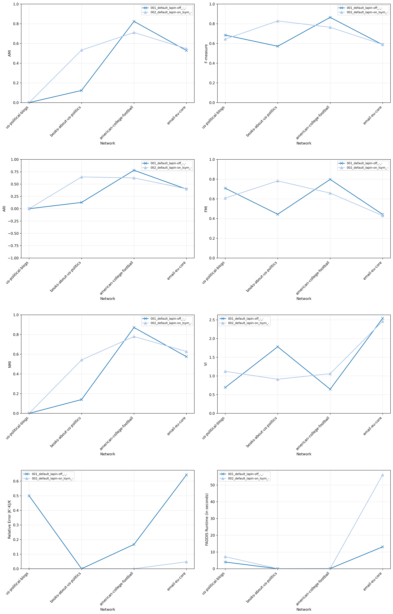
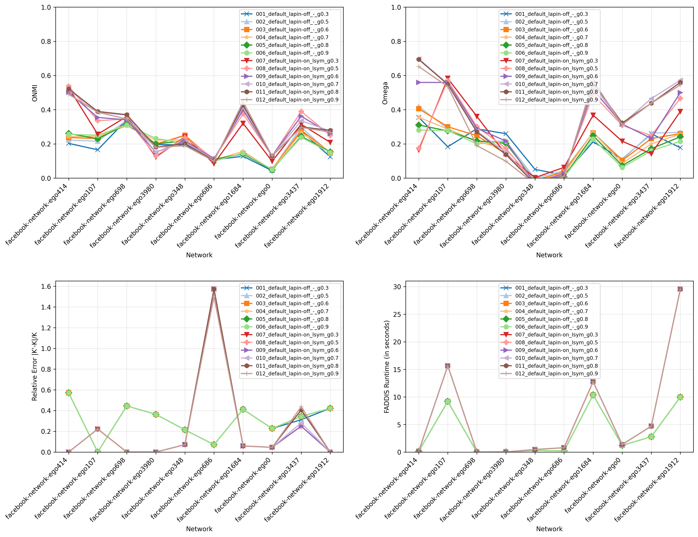
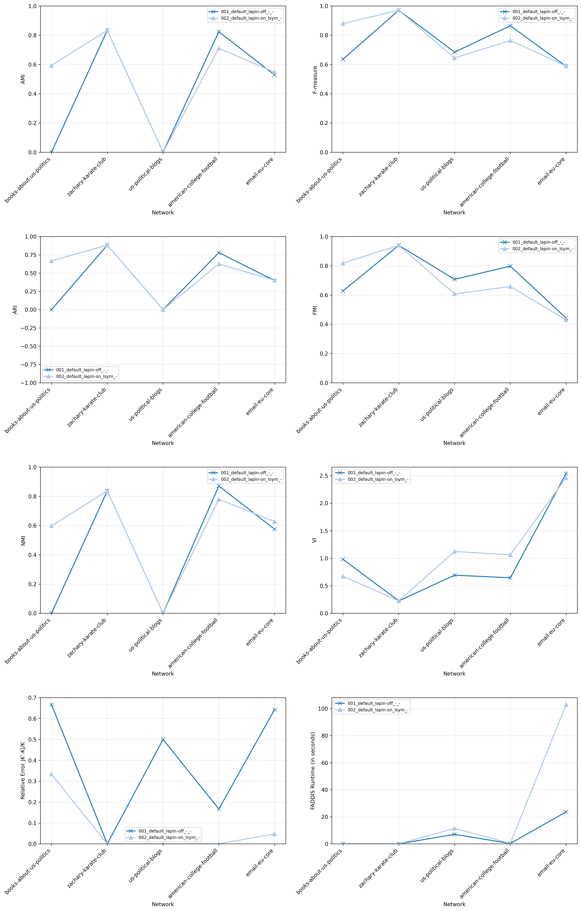
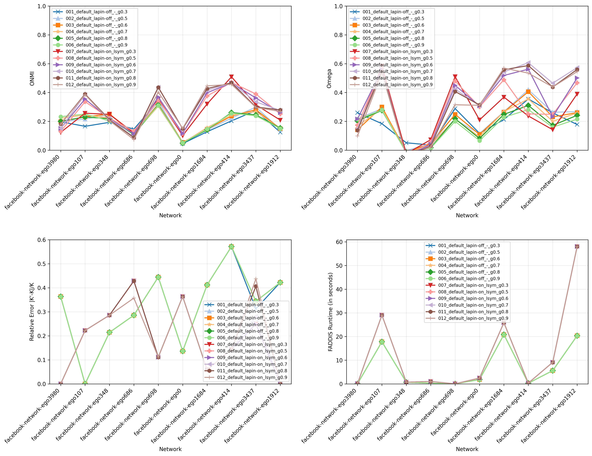

# Report 9 - More experiments on real-world networks with ground-truth

## Table of Contents

- [Experience 7](#experience-7)
    - [LAPIN-off Median Normalized Contributions](#lapin-off-median-normalized-contributions)
    - [LAPIN-on Median Normalized Contributions](#lapin-on-median-normalized-contributions)
    - [LAPIN-off Median K Boundary Normalized Contributions](#lapin-off-median-k-boundary-normalized-contributions)
    - [LAPIN-off Median K Boundary Raw Contributions](#lapin-off-median-k-boundary-raw-contributions)
    - [LAPIN-on Median K Boundary Normalized Contributions](#lapin-on-median-k-boundary-normalized-contributions)
    - [LAPIN-on Median K Boundary Raw Contributions](#lapin-on-median-k-boundary-raw-contributions)
- [Experience 8](#experience-8)
    - [LAPIN-on Median K Boundary Raw Contributions](#lapin-on-median-k-boundary-raw-contributions-1)

## Experience 7

### LAPIN-off Median Normalized Contributions

[Open Folder](../results/real-world/experience7/results_2026-05-18_08-57-04-357791)

### LAPIN-on Median Normalized Contributions

[Open Folder](../results/real-world/experience7/results_2026-05-18_09-14-56-020795)

### LAPIN-off Median K Boundary Normalized Contributions

[Open Folder](../results/real-world/experience7/results_2026-05-18_09-05-00-419889)

### LAPIN-off Median K Boundary Raw Contributions

[Open Folder](../results/real-world/experience7/results_2026-05-18_09-34-47-258253)

### LAPIN-on Median K Boundary Normalized Contributions

[Open Folder](../results/real-world/experience7/results_2026-05-18_09-20-51-445538)

### LAPIN-on Median K Boundary Raw Contributions

[Open Folder](../results/real-world/experience7/results_2026-05-18_09-42-04-813215)

## Experience 8

### LAPIN-on Median K Boundary Raw Contributions

[Open Folder](../results/real-world/experience8/results_2026-05-18_18-59-49-412756)

